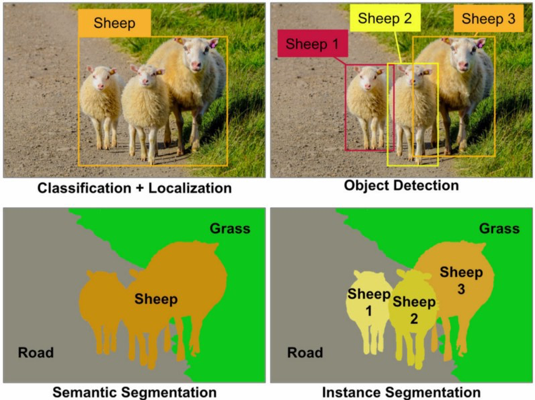
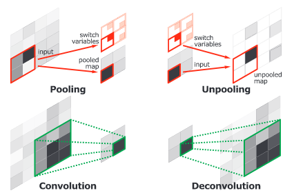
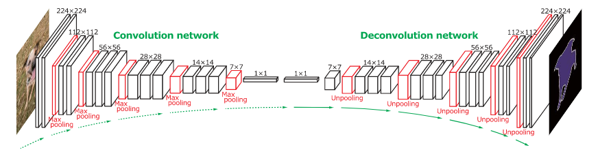

First, you need to install this extension ([Github Math Display](https://chrome.google.com/webstore/detail/github-math-display/cgolaobglebjonjiblcjagnpmdmlgmda/related)) in your chrome in ordrer to read latex.

- [Computer Vision](#computer-vision)
  * [1. Neural Network](#1-neural-network)
    + [1.1 Forward Propogation](#11-forward-propogation)
    + [1.2 Back propogation](#12-back-propogation)
    + [1.3 Loss function](#13-loss-function)
      - [1.3.1 Mean Absolute Error/L1 Loss](#131-mean-absolute-error-l1-loss)
      - [1.3.2 Mean Square Error/Quadratic Loss/L2 Loss](#132-mean-square-error-quadratic-loss-l2-loss)
      - [1.3.3 Hinge Loss](#133-hinge-loss)
      - [1.3.4 Cross Entropy Loss/Negative Log Likelihood](#134-cross-entropy-loss-negative-log-likelihood)
      - [1.3.5 Why we should use cross entropy/hinge loss than squared loss in classification problem?](#135-why-we-should-use-cross-entropy-hinge-loss-than-squared-loss-in-classification-problem-)
    + [1.4 Prevent overfitting](#14-prevent-overfitting)
    + [1.5 Hyperparameter Tuning](#15-hyperparameter-tuning)
      - [1.5.1 Grid Search](#151-grid-search)
      - [1.5.2 Random Search](#152-random-search)
      - [1.5.3 Bayesian optimization](#153-bayesian-optimization)
    + [1.6 CNN Architectures](#16-cnn-architectures)
    + [1.7 Attention](#17-attention)
  * [2. Image processing](#2-image-processing)
    + [2.1 Step 1-Read image](#21-step-1-read-image)
    + [2.2 Step 2-resize image](#22-step-2-resize-image)
    + [2.3 Step 3-Denoise](#23-step-3-denoise)
    + [2.4 Step 4-Gradient calculation](#24-step-4-gradient-calculation)
    + [2.5 Step 5-Non-Maximum Suppression](#25-step-5-non-maximum-suppression)
    + [2.6 Step 6-Double Threshold](#26-step-6-double-threshold)
  * [3. Object detection](#3-object-detection)
    + [3.1 R-CNN Model Family](#31-r-cnn-model-family)
      - [R-CNN](#r-cnn)
      - [Fast R-CNN](#fast-r-cnn)
      - [Faster R-CNN](#faster-r-cnn)
      - [Mask R-CNN](#mask-r-cnn)
    + [3.2 YOLO model family](#32-yolo-model-family)
    + [3.3 SSD](#33-ssd)
  * [4. Image segementation](#4-image-segementation)
    + [Concolutional and Deconvolutional Network](#concolutional-and-deconvolutional-network)
    + [U-Net](#u-net)
  * [5. Image Generation (GAN)](#5-image-generation--gan-)

# Computer Vision
Computer vision is a field of artificial intelligence that trains computers to interpret and understand the visual world. Machines can accurately identify and locate objects then react to what they “see” using digital images from cameras, videos, and deep learning models.

Each pixel is represented by 8 numbers (bits of memory). In computer science, each color is represented by a value.

</img>

Computer Vision can be divied as **Image classification, object detection, segementation (semantic segmentation and instance segmentation), and Image generation(GAN).**

A simple explanation of the **classification** of a picture is when a computer classifies an image in a certain category. In the picture below the classification of the first object would be sheep. The localization or location is identified by the box surrounding the object in the picture.

**Object detection** detects instances of semantic objects of a certain class. The picture below has 3 sheep in the picture. Classifying them (boxes) as sheep1, sheep2, and sheep3.

Every pixel belongs to a particular class. In the picture below the classes are sheep, grass, or road. Pixels within the class are represented by the same color. (sheep is orange, road is gray, and grass is green). This describes **semantic segmentation.**

With **instance segmentation** different objects of the same class have different colors. (sheep1 = bright yellow, sheep2 = dark yellow, sheep3 = orange)



**Distinguishing computer vision from Image processing**
Image processing is focused on processing raw images to apply some kind of transformation. Usually, the goal is to improve images or prepare them as an input for a specific task, while in computer vision the goal is to describe and explain images. For instance, noise reduction, contrast, or rotation operations, typical components of image processing, can be performed at pixel level and do not need a complex grasp of the image that allows for some understanding of what is happening in it.

Examples of image processing include:
- Normalizing photometric properties of the image, such as brightness or color.
- Cropping the bounds of the image, such as centering an object in a photograph.
- Removing digital noise from an image, such as digital artifacts from low light levels.

## 1. Neural Network
### 1.1 Forward Propogation
In order to generate some output, the input data should be fed in the forward direction only. The data should not flow in reverse direction during output generation otherwise it would form a cycle and the output could never be generated. Such network configurations are known as feed-forward network. The feed-forward network helps in forward propagation.
At each neuron in a hidden or output layer, the processing happens in two steps:
- Preactivation: it is a weighted sum of inputs i.e. the linear transformation of weights w.r.t to inputs available. Based on this aggregated sum and activation function the neuron makes a decision whether to pass this information further or not.
- Activation: the calculated weighted sum of inputs is passed to the activation function. An activation function is a mathematical function which adds non-linearity to the network. There are four commonly used and popular activation functions — sigmoid, hyperbolic tangent(tanh), ReLU and Softmax.

</img>
</img>

### 1.2 Back propogation
Back-propagation is the essence of neural net training. It is the practice of fine-tuning the weights of a neural net based on the error rate (i.e. loss) obtained in the previous epoch (i.e. iteration). Proper tuning of the weights ensures lower error rates, making the model reliable by increasing its generalization.

Here is a [video](https://www.youtube.com/watch?v=Ilg3gGewQ5U) which could definitely help you understand back-propogation.

</img>

### 1.3 Loss function
#### 1.3.1 Mean Absolute Error/L1 Loss
$M A E=\frac{\sum_{i=1}^{n}\left|y_{i}-\hat{y}_{i}\right|}{n}$

Mean absolute error, on the other hand, is measured as the average of sum of absolute differences between predictions and actual observations. Like MSE, this as well measures the magnitude of error without considering their direction. Unlike MSE, MAE needs more complicated tools such as linear programming to compute the gradients. Plus MAE is more robust to outliers since it does not make use of square.

Outliers are those data points which differs significantly from other observations present in given dataset. It can occur because of variability in measurement and due to misinterpretation in filling data points.

#### 1.3.2 Mean Square Error/Quadratic Loss/L2 Loss
$M S E=\frac{\sum_{i=1}^{n}\left(y_{i}-\hat{y}_{i}\right)^{2}}{n}$

As the name suggests, Mean square error is measured as the average of squared difference between predictions and actual observations. It’s only concerned with the average magnitude of error irrespective of their direction. However, due to squaring, predictions which are far away from actual values are penalized heavily in comparison to less deviated predictions. Plus MSE has nice mathematical properties which makes it easier to calculate gradients.

#### 1.3.3 Hinge Loss
$SVMLoss =\sum_{j \neq y_{i}} \max \left(0, s_{j}-s_{y_{i}}+1\right)$

In simple terms, the score of correct category should be greater than sum of scores of all incorrect categories by some safety margin (usually one). And hence hinge loss is used for maximum-margin classification (like the figure below, to maximize the delta.), most notably for support vector machines. Although not differentiable, it’s a convex function which makes it easy to work with usual convex optimizers used in machine learning domain.


#### 1.3.4 Cross Entropy Loss/Negative Log Likelihood
$CrossEntropyLoss =-\left(y_{i} \log \left(\hat{y}_{i}\right)+\left(1-y_{i}\right) \log \left(1-\hat{y}_{i}\right)\right)$

This is the most common setting for classification problems. Cross-entropy loss increases as the predicted probability diverges from the actual label.

Notice that when actual label is 1 (y(i) = 1), second half of function disappears whereas in case actual label is 0 (y(i) = 0) first half is dropped off. In short, we are just multiplying the log of the actual predicted probability for the ground truth class. An important aspect of this is that cross entropy loss penalizes heavily the predictions that are confident but wrong.

#### 1.3.5 Why we should use cross entropy/hinge loss than squared loss in classification problem?
Cross entropy has some advantages: Cross entropy loss penalizes heavily the predictions that are confident but wrong. However, for squared loss, it has $\hat{y}(1-\hat{y})$ in its gradient term. When $\hat{y}$ is close to 0.0 or 1.0, the speed of update becomes very slow.

**Gradient of squared error loss: 2-class scenario**

First the predictions function is $y_i = \sigma(Wx_i + b)$, and loss function is $J = \frac{1}{2}\left(\hat{y}_i-y_{i}\right)^{2}$. We get the derivation of $J: \frac{d J}{d W} = \left(\hat{y}_{i}-y_{i}\right)\sigma'(Wx_i + b)x_i$, for function $\sigma'$: $\sigma^{\prime}\left(W x_{i}+b\right)=\sigma\left(W x_{i}+b\right)\left(1-\sigma\left(W x_{i}+b\right)\right)$. So, we could get: $\frac{d J}{d W}=\left(\hat{y}_{i}-y_{i}\right) \widehat{y_{i}}\left(1-\widehat{y_{i}}\right) x_{i}$.

It is obvious that When $\hat{y}$ is close to 0.0 or 1.0, $\hat{y}(1-\hat{y})$ is close to 0 which is not good for updating parameters.

**Gradient of cross entropy loss: 2-class scenario**

First the predictions function is $\widehat{y_{i}}=\sigma\left(x_{i}\right)=\sigma\left(W x_{i}+b\right)$, and loss function is $J=\sum_{i=1}^{n}\left[-y_{i} \log \left(\sigma\left(x_{i}\right)\right)-\left(1-y_{i}\right) \log \left(1-\sigma\left(x_{i}\right)\right)\right]$

and we get the derivation of $J: \frac{d J}{d W}=\sum_{i=1}^{n}\left[-y_{i} \log \left(\sigma\left(x_{i}\right)\right)-\left(1-y_{i}\right) \log \left(1-\sigma\left(x_{i}\right)\right)\right]$

$\frac{d J}{d W}=\sum_{i=1}^{n}\left[-y_{i} \frac{\sigma\left(x_{i}\right)\left(1-\sigma\left(x_{i}\right)\right) x_{i}}{\sigma\left(x_{i}\right)}+\left(1-y_{i}\right) \frac{\sigma\left(x_{i}\right)\left(1-\sigma\left(x_{i}\right)\right) x_{i}}{1-\sigma\left(x_{i}\right)}\right]$

$\frac{d J}{d W}=\sum_{i=1}^{n}\left[-y_{i}\left(1-\sigma\left(x_{i}\right)\right) x_{i}+\left(1-y_{i}\right) \sigma\left(x_{i}\right) x_{i}\right]$

$\frac{d J}{d W}=\sum_{i=1}^{n}\left[-y_{i} x_{i}+y_{i} \sigma\left(x_{i}\right) x_{i}+\sigma\left(x_{i}\right) x_{i}-y_{i} \sigma\left(x_{i}\right) x_{i}\right]$

$\frac{d J}{d W}=\sum_{i=1}^{n}\left[\left(\sigma\left(x_{i}\right)-y_{i}\right) x_{i}\right]=\sum_{i=1}^{n}\left(\widehat{y_{i}}-y_{i}\right) x_{i}$

We could easily see that the problem mentioned above is avoided.

So, my suggestions is for **regression problem**, **squared loss** is a better option. For **classification**, **cross entropy/hinge loss** is more compatible.

### 1.4 Prevent overfitting
This [blog](https://www.kaggle.com/learn-forum/157623) will help you get a full overview of approaches to prevent overfitting.

### 1.5 Hyperparameter Tuning
This is often referred to as "searching" the hyperparameter space for the optimum values. In the following visualization, the $x$ and $y$ dimensions represent two hyperparameters, and the $z$ dimension represents the model's score (defined by some evaluation metric) for the architecture defined by $x$ and $y$.

</img>

When building such a model, two important hyperparameters to consider are:

- How many estimators (ie. decision trees) should I use?
- What should be the maximum allowable depth for each decision tree?
#### 1.5.1 Grid Search
Grid search is arguably the most basic hyperparameter tuning method. With this technique, we simply build a model for each possible combination of all of the hyperparameter values provided, evaluating each model, and selecting the architecture which produces the best results.

Each model would be fit to the training data and evaluated on the validation data. As you can see, this is an exhaustive sampling of the hyperparameter space and can be quite inefficient.

</img>

#### 1.5.2 Random Search
Random search differs from grid search in that we longer provide a discrete set of values to explore for each hyperparameter; rather, we provide a statistical distribution for each hyperparameter from which values may be randomly sampled.

In the following example, we're searching over a hyperparameter space where the one hyperparameter has significantly more influence on optimizing the model score - the distributions shown on each axis represent the model's score. In each case, we're evaluating nine different models. The grid search strategy blatantly misses the optimal model and spends redundant time exploring the unimportant parameter. During this grid search, we isolated each hyperparameter and searched for the best possible value while holding all other hyperparameters constant. For cases where the hyperparameter being studied has little effect on the resulting model score, this results in wasted effort. Conversely, the random search has much improved exploratory power and can focus on finding the optimal value for the important hyperparameter.

</img>

As you can see, this search method works best under the assumption that not all hyperparameters are equally important. While this isn't always the case, the assumption holds true for most datasets.

</img>

#### 1.5.3 Bayesian optimization
The previous two methods performed individual experiments building models with various hyperparameter values and recording the model performance for each. Because each experiment was performed in isolation, it's very easy to parallelize this process. However, because each experiment was performed in isolation, we're not able to use the information from one experiment to improve the next experiment. Bayesian optimization belongs to a class of sequential model-based optimization (SMBO) algorithms that allow for one to use the results of our previous iteration to improve our sampling method of the next experiment.

We'll initially define a model constructed with hyperparameters $\lambda$ which, after training, is scored $v$ according to some evaluation metric. Next, we use the previously evaluated hyperparameter values to compute a posterior expectation of the hyperparameter space. We can then choose the optimal hyperparameter values according to this posterior expectation as our next model candidate. We iteratively repeat this process until converging to an optimum.

We'll use a Gaussian process to model our prior probability of model scores across the hyperparameter space. This model will essentially serve to use the hyperparameter values $λ_{1,...i}$ and corresponding scores $v_{1,...i}$ we've observed thus far to approximate a continuous score function over the hyperparameter space. This approximated function also includes the degree of certainty of our estimate, which we can use to identify the candidate hyperparameter values that would yield the largest expected improvement over the current score. The formulation for expected improvemenet is known as our acquisition function, which represents the posterior distribution of our score function across the hyperparameter space.

</img>

### 1.6 CNN Architectures
This [blog](https://towardsdatascience.com/illustrated-10-cnn-architectures-95d78ace614d) will give you overview of CNN architecture such as LeNet-5, AlexNet, VGG-16, Inception-v1, Inception-v3, ResNet-50, Xception, Inception-v4, Inception-ResNets, ResNeXt-50.

Moreover, the simplest convolutional network block can be illustrated as below:

</img>

The feature extraction performed by the base consists of three basic operations:
- Convolution: Filter an image for a particular feature 
- ReLU: Detect that feature within the filtered image 
- Pooling: Condense the image to enhance the features 

### 1.7 Attention
In the context of machine learning, attention is a technique that mimics cognitive attention, defined as the ability to choose and concentrate on relevant stimuli. In other words, attention is a method that tries to enhance the important parts while fading out the non-relevant information.

There are four broader categories of attention models. Each category has different types of attention models. Although these categories are mutually exclusive, we can apply attention models using a combination of different categories. Hence, these categories can also be considered as dimensions.

</img>

- Number of Sequences: In Distinctive Attention models, the candidate state and query states from encoder-decoder belong to two distinct input and output sequences. Co-attention models have multiple input sequences at the same time. Attention weights are learned based on all the input sequences. Co-attention models can be used for image inputs. In recommendations and text classification problems, the input is in sequence, but the output is not a sequence. For such issues, Self-Attention is used where candidate state and query state both belongs to the same input sequence.

- Number of Abstractions: The attention models having single level abstractions compute attention weights just for the original input sequence. The multi-level abstraction attention models apply attention on multiple levels of abstraction on the input sequence. In this type of attention, the lower abstraction level’s context vector becomes the query state for high-level abstraction. Such models can be classified further as top-down or bottom-up models.

- Number of Positions: In this category of attention models, the models are further classified based on the input sequence position where attention function is calculated. In Soft Attention models, the context vector is computed using the weighted average of all hidden stages of the input sequence. These models enable the neural network to learn from backpropagation efficiently. However, it leads to quadratic computational loss. In hard attention models, the context vector is built using hidden states which are stochastically sampled in the input sequence. The global attention model is similar to the soft attention model, whereas the local attention model is midway between soft and hard attention mechanisms.

- Number of Representations: The Multi-Representational attention models determine different aspects of the input sequence through multiple feature representations. The weight importance is assigned to these multiple feature representations using attention to decide which aspects are most relevant. In multi-dimensional attention, the weights are generated to determine the relevance of each dimension of the input sequence. These models are used for natural language processing applications.

## 2. Image processing
An image is nothing more than a two-dimensional array of numbers(or pixels) ranging between 0 and 255. It is defined by the mathematical function f(x,y) where x and y are the two co-ordinates horizontally and vertically.

The value of f(x,y) at any point is giving the pixel value at that point of an image.

### 2.1 Step 1-Read image
In this step, we store the path to our image dataset into a variable then we created a function to load folders containing images into arrays.

There are many tools we can choose, for Keras, we could use pandas; for pytorch, official image import library is more convenient.

### 2.2 Step 2-resize image
Some images captured by a camera and fed to our AI algorithm vary in size, therefore, we should establish a base size for all images fed into our AI algorithms.

### 2.3 Step 3-Denoise
Since the mathematics involved behind the scene are mainly based on derivatives, edge detection results are highly sensitive to image noise. One way to get rid of the noise on the image, is by applying Gaussian blur to smooth it. Gaussian blur (also known as Gaussian smoothing) is the result of blurring an image by a Gaussian function. It is a widely used effect in graphics software, typically to reduce image noise. The visual effect of this blurring technique is a smooth blur resembling that of viewing the image through a translucent screen, distinctly different from the bokeh effect produced by an out-of-focus lens or the shadow of an object under usual illumination. To do so, image convolution technique is applied with a Gaussian Kernel (3x3, 5x5, 7x7 etc…). The kernel size depends on the expected blurring effect. Basically, the smallest the kernel, the less visible is the blur.

The equation for a Gaussian filter kernel of size (2k+1)×(2k+1) is given by:
$H_{i j}=\frac{1}{2 \pi \sigma^{2}} \exp \left(-\frac{(i-(k+1))^{2}+(j-(k+1))^{2}}{2 \sigma^{2}}\right) ; 1 \leq i, j \leq(2 k+1)$

```python
import numpy as np

def gaussian_kernel(size, sigma=1):
    size = int(size) // 2
    x, y = np.mgrid[-size:size+1, -size:size+1]
    normal = 1 / (2.0 * np.pi * sigma**2)
    g =  np.exp(-((x**2 + y**2) / (2.0*sigma**2))) * normal
    return g
```
After applying the Gaussian blur, we get the following result:
</img>

### 2.4 Step 4-Gradient calculation
The Gradient calculation step detects the edge intensity and direction by calculating the gradient of the image using edge detection operators.

Edges correspond to a change of pixels’ intensity. To detect it, the easiest way is to apply filters that highlight this intensity change in both directions: horizontal (x) and vertical (y).

When the image is smoothed, the derivatives Ix and Iy w.r.t. x and y are calculated. It can be implemented by convolving I with Sobel kernels Kx and Ky, respectively:
$K_{x}=\left(\begin{array}{ccc}-1 & 0 & 1 \\ -2 & 0 & 2 \\ -1 & 0 & 1\end{array}\right), K_{y}=\left(\begin{array}{ccc}1 & 2 & 1 \\ 0 & 0 & 0 \\ -1 & -2 & -1\end{array}\right)$

Then, the magnitude G and the slope θ of the gradient are calculated as follow:
$\begin{aligned}|G| &=\sqrt{I_{x}^{2}+I_{y}^{2}} \\ \theta(x, y) &=\arctan \left(\frac{I_{y}}{I_{x}}\right) \end{aligned}$

Below is how the Sobel filters are applied to the image, and how to get both intensity and edge direction matrices:
```python
from scipy import ndimage

def sobel_filters(img):
    Kx = np.array([[-1, 0, 1], [-2, 0, 2], [-1, 0, 1]], np.float32)
    Ky = np.array([[1, 2, 1], [0, 0, 0], [-1, -2, -1]], np.float32)
    
    Ix = ndimage.filters.convolve(img, Kx)
    Iy = ndimage.filters.convolve(img, Ky)
    
    G = np.hypot(Ix, Iy)
    G = G / G.max() * 255
    theta = np.arctan2(Iy, Ix)
    
    return (G, theta)
```

</img>

The result is almost the expected one, but we can see that some of the edges are thick and others are thin. Non-Max Suppression step will help us mitigate the thick ones.

### 2.5 Step 5-Non-Maximum Suppression
Ideally, the final image should have thin edges. Thus, we must perform non-maximum suppression to thin out the edges. The principle is simple: the algorithm goes through all the points on the gradient intensity matrix and finds the pixels with the maximum value in the edge directions.

Let’s take an easy example:

</img>

The upper left corner red box present on the above image, represents an intensity pixel of the Gradient Intensity matrix being processed. The corresponding edge direction is represented by the orange arrow with an angle of -pi radians (+/-180 degrees).

</img>

The edge direction is the orange dotted line (horizontal from left to right). The purpose of the algorithm is to check if the pixels on the same direction are more or less intense than the ones being processed. In the example above, the pixel $(i, j)$ is being processed, and the pixels on the same direction are highlighted in blue $(i, j-1)$ and $(i, j+1)$. If one those two pixels are more intense than the one being processed, then only the more intense one is kept. Pixel $(i, j-1)$ seems to be more intense, because it is white (value of 255). Hence, the intensity value of the current pixel $(i, j)$ is set to 0. If there are no pixels in the edge direction having more intense values, then the value of the current pixel is kept.

Let’s now focus on another example:

</img>

In this case the direction is the orange dotted diagonal line. Therefore, the most intense pixel in this direction is the pixel $(i-1, j+1)$.

Let’s sum this up. Each pixel has 2 main criteria (edge direction in radians, and pixel intensity (between 0–255)). Based on these inputs the non-max-suppression steps are:
- Create a matrix initialized to 0 of the same size of the original gradient intensity matrix;
- Identify the edge direction based on the angle value from the angle matrix;
- Check if the pixel in the same direction has a higher intensity than the pixel that is currently processed;
- Return the image processed with the non-max suppression algorithm.
```python
def non_max_suppression(img, D):
    M, N = img.shape
    Z = np.zeros((M,N), dtype=np.int32)
    angle = D * 180. / np.pi
    angle[angle < 0] += 180

    
    for i in range(1,M-1):
        for j in range(1,N-1):
            try:
                q = 255
                r = 255
                
               #angle 0
                if (0 <= angle[i,j] < 22.5) or (157.5 <= angle[i,j] <= 180):
                    q = img[i, j+1]
                    r = img[i, j-1]
                #angle 45
                elif (22.5 <= angle[i,j] < 67.5):
                    q = img[i+1, j-1]
                    r = img[i-1, j+1]
                #angle 90
                elif (67.5 <= angle[i,j] < 112.5):
                    q = img[i+1, j]
                    r = img[i-1, j]
                #angle 135
                elif (112.5 <= angle[i,j] < 157.5):
                    q = img[i-1, j-1]
                    r = img[i+1, j+1]

                if (img[i,j] >= q) and (img[i,j] >= r):
                    Z[i,j] = img[i,j]
                else:
                    Z[i,j] = 0

            except IndexError as e:
                pass
    
    return Z
```
The result is the same image with thinner edges. We can however still notice some variation regarding the edges’ intensity: some pixels seem to be brighter than others, and we will try to cover this shortcoming with the two final steps.

</img>

### 2.6 Step 6-Double Threshold
The double threshold step aims at identifying 3 kinds of pixels: strong, weak, and non-relevant:
- Strong pixels are pixels that have an intensity so high that we are sure they contribute to the final edge.
- Weak pixels are pixels that have an intensity value that is not enough to be considered as strong ones, but yet not small enough to be considered as non-relevant for the edge detection.
- Other pixels are considered as non-relevant for the edge.

Now you can see what the double thresholds holds for:
- High threshold is used to identify the strong pixels (intensity higher than the high threshold)
- Low threshold is used to identify the non-relevant pixels (intensity lower than the low threshold)
- All pixels having intensity between both thresholds are flagged as weak and the Hysteresis mechanism (next step) will help us identify the ones that could be considered as strong and the ones that are considered as non-relevant.
```python
def threshold(img, lowThresholdRatio=0.05, highThresholdRatio=0.09):
    
    highThreshold = img.max() * highThresholdRatio;
    lowThreshold = highThreshold * lowThresholdRatio;
    
    M, N = img.shape
    res = np.zeros((M,N), dtype=np.int32)
    
    weak = np.int32(25)
    strong = np.int32(255)
    
    strong_i, strong_j = np.where(img >= highThreshold)
    zeros_i, zeros_j = np.where(img < lowThreshold)
    
    weak_i, weak_j = np.where((img <= highThreshold) & (img >= lowThreshold))
    
    res[strong_i, strong_j] = strong
    res[weak_i, weak_j] = weak
    
    return (res, weak, strong)
```
The result of this step is an image with only 2 pixel intensity values (strong and weak):

</img>

## 3. Object detection
Object detection is a process of finding all the possible instances of real-world objects, such as human faces, flowers, cars, etc. in images or videos, in real-time with utmost accuracy. 

### 3.1 R-CNN Model Family
This includes the techniques R-CNN, Fast R-CNN, and Faster-RCNN designed and demonstrated for object localization and object recognition.

#### R-CNN
The R-CNN system is comprised of three main modules. The foremost module extracts around 2000 region proposals using a segmentation algorithm called selective search, to figure out which parts of an image are most probable to contain an object. Selective Search applies a variety of different strategies, so it can handle as many image conditions as possible. The algorithm scans the image with windows of various scales, and looks for adjacent pixels that share colors and textures, while also taking lightning conditions into an account.

The second module is a large convolutional neural network that extracts a fixed-length feature vector from each proposal that is returned from the selective search. Regardless of the size or aspect ratio, the candidate region undergoes image warping to have the required input size. Lastly, the final module classifies each region with category-specific linear SVMs.

R-CNN is very slow to train and test, and not very accurate by today’s standards. Nevertheless, it is an essential method that paved the way for Fast R-CNN, and the current state-of-the-art Faster R-CNN and Mask R-CNN.

</img>

#### Fast R-CNN
Fast R-CNN was proposed by one of the authors of R-CNN, as a worthy successor. One big improvement over R-CNN is that instead of making ~2000 forward passes for each region proposal, Fast R-CNN computes a convolutional feature map for the entire input image in a single forward pass of the network, making it much faster. Another improvement is that the architecture is trained end-to-end with a multi-task loss, resulting in simpler training.

The input for Fast R-CNN is an image, along with a set of object proposals. First, they are passed through a fully convolutional network to obtain the convolutional feature map. Next, for each object proposal, a fixed-length feature vector is extracted from the feature map using a region of interest (RoI) pooling layer. Fast R-CNN maps each of these RoIs into a feature vector using fully connected layers, to finally output softmax probability and the bounding box, which are the class and position of the object, respectively.

</img>

#### Faster R-CNN
It consists of two modules: a CNN called Region Proposal Network (RPN), and the Fast R-CNN detector. The two modules are merged into a single network and trained end-to-end.

The authors of Faster R-CNN drew inspiration from the attention mechanism when they designed RPN to emphasize what is important in the input image. Creating region proposals is done by sliding a small network over the last shared convolution layer of the network. The small network requires a (n x n) window of the convolutional feature map as an input. Each sliding window is mapped to a lower-dimensional feature, so just like before, it is fed to two fully connected layers: a box-classification and box-regression layer.

It is important to mention that the bounding boxes are parametrized relative to hand-picked reference boxes called anchors. In other words, the RPN predicts the four correction coordinates to move and resize an anchor to the right position, instead of the coordinates on the image. Faster R-CNN is using 3 scales and 3 aspect ratios by default, resulting in 9 anchors at each sliding window.

</img>

Faster R-CNN is considered state-of-the-art, and it is certainly one of the best options for object detection. However, it does not provide segmentation on the detected objects, i.e. it is not capable of locating the exact pixels of the object, rather just the bounding box around it. In many cases this is not needed, but when it is, Mask R-CNN should be the first one to come to mind.

#### Mask R-CNN
The Mask R-CNN authors at Facebook AI Research (FAIR) extended Faster R-CNN to perform instance segmentation, along with the class and bounding box. Instance segmentation is a combination of object detection and semantic segmentation, which means that it performs both detection of all objects in an image, and segmentation of each instance while differentiating it from the rest of the instances.

The first stage (region proposal) of Mask R-CNN is identical to its predecessor, while in the second stage it outputs a binary mask for each RoI in parallel to the class and bounding box. This binary mask denotes whether the pixel is part of any object, without concern for the categories. The class for the pixels would be assigned simply by the bounding box that they reside in, which makes the model a lot easier to train.

Another difference in the second stage is that the RoI pooling layer (RoIPool) introduced in Fast R-CNN is replaced with RoIAlign. Performing instance segmentation with RoIPool results in many pixel-wise inaccuracies, i.e. misaligned feature map when compared to the original image. This occurs because RoIPool performs quantization of the regions of interest, which includes rounding the floating-point values to decimal values in the resulting feature map. On the other hand, the improved RoIAlign properly aligns the extracted features with the input, by avoiding any quantization altogether, rather using bilinear interpolation to compute the exact values of the input features.

</img>

### 3.2 YOLO model family
We are now switching focus from an accuracy-oriented solution, to a speed-oriented one. You Only Look Once (YOLO) is the most popular object detection method today, with a good reason. It is capable of processing real-time videos with minimal delay, all the while retaining respectable accuracy. And as the name suggests, it only needs one forward propagation to detect all objects in an image.

The last iteration is [YOLOv3](https://arxiv.org/abs/1804.02767), which is bigger, more accurate on small objects, but slightly worse on larger objects when compared to the previous version. In YOLOv3, Darknet-53 (53-layer CNN with residual connections) is used, which is quite a leap from the previous Darknet-19 (19-layer CNN) for YOLOv2.

Unlike the previous YOLO versions that output the bounding box, confidence and class for the box, YOLOv3 predicts bounding boxes at 3 different scales on different depths of the network. The final object detections on the image are decided using non-max suppression (NMS), a simple method that removes bounding boxes which overlap with each other more than a predefined intersection-over-union (IoU) threshold. In such overlapping conflict, the bounding box with the largest confidence assigned by YOLO wins, while the others are discarded.

</img>

Just like in Faster R-CNN, the box values are relative to reference anchors. However, instead of having the same handpicked anchors for any task, it uses k-means clustering on the training dataset to find the optimal anchors for the task. The default number of anchors for YOLOv3 is 9. It might also come as a surprise that softmax is not used for class prediction, but rather multiple independent logistic classifiers, trained with binary cross-entropy loss.

### 3.3 SSD
Single Shot MultiBox Detector (SSD) came out a couple of months after YOLO as a worthy alternative. Similarly to YOLO, the object detection is done in a single forward propagation of the network. This end-to-end CNN model passes the input image through a series of convolutional layers, generating candidate bounding boxes from different scales along the way.

As ground truth for training, SSD considers the labeled objects as positive examples, and any other bounding boxes that do not overlap with the positives are negative examples. It turns out that constructing the dataset this way makes it very imbalanced. For that reason, SSD applies a method called hard negative mining right after performing NMS. Hard negative mining is a method to pick only the negative examples with the highest confidence loss, so that the ratio between the positives and negatives is at most 1:3. This leads to faster optimization and a more stable training phase.

In the image above that can be found in the official paper, we can see that the backbone network is VGG-16. However, nowadays we can often see SSD with a ResNet, Inception and even MobileNet backbone.

[Detectron2](https://github.com/facebookresearch/detectron2) is Facebook AI Research's next generation library that provides state-of-the-art detection and segmentation algorithms.

</img>

Plus, more details are written in this [blog - Object Detection and Tracking in 2020.](https://blog.netcetera.com/object-detection-and-tracking-in-2020-f10fb6ff9af3)

## 4. Image segementation
Image segmentation is the process of labeling regions in an image, often down to the pixel level. There are two common types of image segmentation:
- Instance segmentation: This process gives each individual instance of one or multiple object classes a distinct label. In a family photo containing several people, this type of model would automatically highlight each person with a different color.
- Semantic segmentation: This process labels each pixel of an image according to the class of object or texture it represents. For example, pixels in an image of a city street scene might be labeled as “pavement,” “sidewalk,” “building,” “pedestrian,” or “vehicle.”

Segmentation models are useful for a variety of tasks, including:
- Autonomous vehicles: We need to equip cars with the necessary perception to understand their environment so that self-driving cars can safely integrate into our existing roads.
- Medical image diagnostics: Machines can augment analysis performed by radiologists, greatly reducing the time required to run diagnositic tests.

### Concolutional and Deconvolutional Network
H. Noh et al. (2015) have released an end-to-end model composed of two linked parts. The first part is a convolutional network with a VGG16 architecture. It takes as input an instance proposal, for example a bounding box generated by an object detection model. The proposal is processed and transformed by a convolutional network to generate a vector of features. 

The second part is a deconvolutional network taking the vector of features as input and generating a map of pixel-wise probabilities belonging to each class. The deconvolutional network uses unpooling targeting the maxium activations to keep the location of the information in the maps. The second network also uses deconvolution associating a single input to multiple feature maps. The deconvolution expands feature maps while keeping the information dense.

</img>

The authors have analysed deconvolution feature maps and they have noted that the low-level ones are specific to the shape while the higher-level ones help to classify the proposal. Finally, when all the proposals of an image are processed by the entire network, the maps are concatenated to obtain the fully segmented image. This network has obtained a 72.5% mIoU on the 2012 PASCAL VOC segmentation challenge.

</img>

### U-Net
U-net builds on top of the fully convolutional network from above. It was built for medical purposes to find tumours in lungs or the brain. It also consists of an encoder which down-samples the input image to a feature map and the decoder which up samples the feature map to input image size using learned deconvolution layers.

</img>

U-Net proposes a new approach to solve this information loss problem. It proposes to send information to every up sampling layer in decoder from the corresponding down sampling layer in the encoder as can be seen in the figure above thus capturing finer information whilst also keeping the computation low. Since the layers at the beginning of the encoder would have more information they would bolster the up sampling operation of decoder by providing fine details corresponding to the input images thus improving the results a lot.

More details are written in this [blog.](https://nanonets.com/blog/semantic-image-segmentation-2020/) And [Pytorch-semseg](https://github.com/meetps/pytorch-semseg) aims at mirroring popular semantic segmentation architectures in PyTorch. Additionally, here is [a full list](https://github.com/mrgloom/awesome-semantic-segmentation) of semantic segmentation.

## 5. Image Generation (GAN)
Generative Adversarial Networks are a powerful class of neural networks with remarkable applications. They essentially consist of a system of two neural networks — the Generator and the Discriminator — dueling each other. Here [GAN lab](https://poloclub.github.io/ganlab/) is its visulization.

Here’s the map of the GAN landscape:

</img>

This [blog](https://blog.floydhub.com/gans-story-so-far/) will give you a full overview of GAN. [Curated list of awesome GAN applications and demonstrations](https://github.com/nashory/gans-awesome-applications) and [GAN Zoo](https://github.com/hindupuravinash/the-gan-zoo) are listed here.


