First, you need to install this extension [Github Math Display](https://chrome.google.com/webstore/detail/github-math-display/cgolaobglebjonjiblcjagnpmdmlgmda/related) in your chrome in ordrer to read latex.
- [0. Introduction](#0-introduction)
  * [0.1 Why is NLP difficult?](#01-why-is-nlp-difficult-)
  * [0.2 Techniques](#02-techniques)
    + [0.2.1 Syntax](#021-syntax)
    + [0.2.2 Semantics](#022-semantics)
- [1. Pipeline to build NLP model](#1-pipeline-to-build-nlp-model)
  * [1.1 Text Processing](#11-text-processing)
    + [Tokenization](#tokenization)
    + [Stop Words removal](#stop-words-removal)
    + [Part of Speech Tagging](#part-of-speech-tagging)
    + [Named Entity Recognition — NER](#named-entity-recognition---ner)
    + [Stemming](#stemming)
    + [Lemmatization](#lemmatization)
  * [1.2 Feature Extraction/representation](#12-feature-extraction-representation)
    + [1.2.1 one-hot encoding](#121-one-hot-encoding)
    + [1.2.2 Bag of words (BOW) model](#122-bag-of-words--bow--model)
      - [Term Frequency — Inverse Document Frequency (TF-IDF)](#term-frequency---inverse-document-frequency--tf-idf-)
    + [1.2.3 Word2Vec](#123-word2vec)
    + [1.2.4 GloVe](#124-glove)
      - [N-grams](#n-grams)
    + [1.2.5 Vector Similarity](#125-vector-similarity)
      - [Cosine Similarity](#cosine-similarity)
      - [Word mover’s distance](#word-mover-s-distance)
      - [The Euclidean distance](#the-euclidean-distance)
  * [1.3 Modeling](#13-modeling)
    + [1.3.1 Recurrent Neural Network](#131-recurrent-neural-network)
    + [1.3.2 Long Short Term Memory networks (LSTM)](#132-long-short-term-memory-networks--lstm-)
- [2. Toy Example](#2-toy-example)
  * [2.1 Text Processing](#21-text-processing)
  * [2.2 Feature Extraction](#22-feature-extraction)
- [4. Application](#4-application)
  * [Sentiment Analysis](#sentiment-analysis)
  * [Machine Translation](#machine-translation)
  * [Question Anwsering](#question-anwsering)
- [5. Library](#5-library)
- [6. Research Survey](#6-research-survey)

# 0. Introduction
NLP is an interdisciplinary field concerned with the interactions between computers and natural human languages.

NLP is divided into two fields: Linguistics and Computer Science.

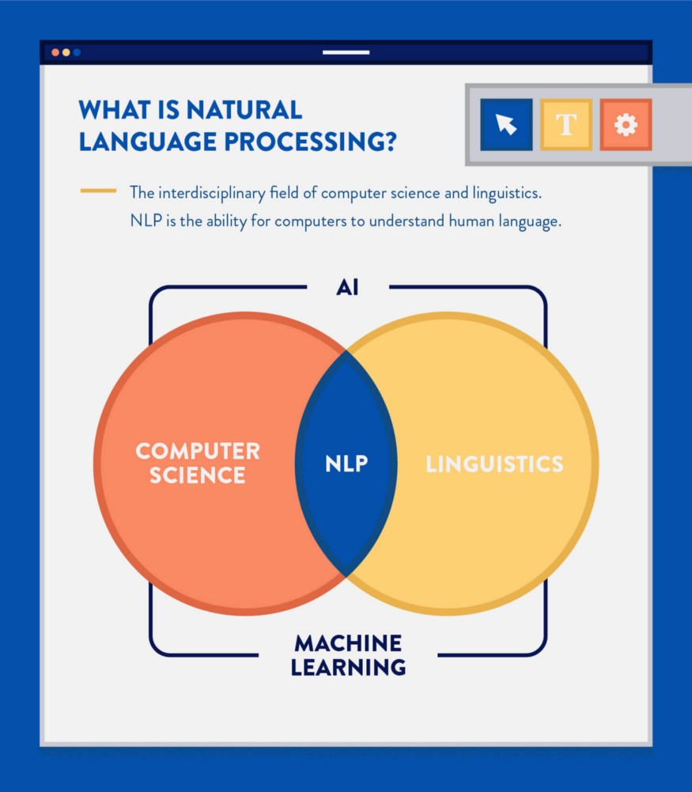</img>

- The Linguistics side is concerned with language, it’s formation, syntax, meaning, different kind of phrases (noun or verb) and what not.
- The Computer Science side is concerned with applying linguistic knowledge, by transforming it into computer programs with the help of sub-fields such as Artificial Intelligence (Machine Learning & Deep Learning). This process can be divieded into two parts: NLU (understanding; text/speech --> understanding) and NLG (generation; understanding --> text/speech). 

Scientific advancements in NLP can be divided into three categories (**Rule-based systems, Classical Machine Learning models and Deep Learning models**).
- Rule-based systems rely heavily on crafting domain-specific rules (e.g., regular expressions), can be used to solve simple problems such as extracting structured data (e.g., emails) from unstructured data (e.g., web-pages), but due to the complexity of natural human languages, rule-based systems fail to build models that can reason about language.
- Classical Machine Learning approaches can be used to solve more challenging problems which rule-based systems can’t solve very well (e.g., Spam Detection), it relies on a more general approach to understanding language, using hand-crafted features (e.g., sentence length, part of speech tags, the occurrence of specific words) then providing those features to a statistical machine learning model (e.g., Naive Bayes), which learns different patterns in the training set and then be able to reason about unseen data (inference).
- Deep Learning models are the hottest part of NLP research and applications now. They generalize even better than the classical machine learning approaches as they don’t need hand-crafted features because they automatically work as feature extractors, which helped a lot in building end-to-end models (little human-interaction). Aside from the feature engineering part, deep learning algorithms learning capabilities are more powerful than the shallow/classical ML ones, which paved its way to achieving the highest scores on different challenging NLP tasks (e.g., Machine Translation).

## 0.1 Why is NLP difficult?
Natural Language processing is considered a difficult problem in computer science. It’s the nature of the human language that makes NLP difficult.
- Multiple ways to express
- Ambiguity
- Multi-modal
For example, when we say “bush” we may refer to the plant or to the former US President. Identifying the difference may be very easy for you, but a computer will have to go through several steps from the pipeline until deciding which meaning you are using.

## 0.2 Techniques
Syntactic analysis and semantic analysis are the main techniques used to complete Natural Language Processing tasks. The techniques can be divieded into four dimensions: semantic, syntax, morphology, phonetics.
### 0.2.1 Syntax
Syntax refers to the arrangement of words in a sentence such that they make grammatical sense.
In NLP, syntactic analysis is used to assess how the natural language aligns with the grammatical rules.
Computer algorithms are used to apply grammatical rules to a group of words and derive meaning from them.
Here are some syntax techniques that can be used:
- Lemmatization: It entails reducing the various inflected forms of a word into a single form for easy analysis.
- Morphological segmentation: It involves dividing words into individual units called morphemes.
- Word segmentation: It involves dividing a large piece of continuous text into distinct units.
- Part-of-speech tagging: It involves identifying the part of speech for every word.
- Parsing: It involves undertaking grammatical analysis for the provided sentence.
- Sentence breaking: It involves placing sentence boundaries on a large piece of text.
- Stemming: It involves cutting the inflected words to their root form.
### 0.2.2 Semantics
Semantics refers to the meaning that is conveyed by a text. Semantic analysis is one of the difficult aspects of Natural Language Processing that has not been fully resolved yet.
It involves applying computer algorithms to understand the meaning and interpretation of words and how sentences are structured.
Here are some techniques in semantic analysis:
- Named entity recognition (NER): It involves determining the parts of a text that can be identified and categorized into preset groups. Examples of such groups include names of people and names of places.
- Word sense disambiguation: It involves giving meaning to a word based on the context.
- Natural language generation: It involves using databases to derive semantic intentions and convert them into human language.

# 1. Pipeline to build NLP model
The common NLP pipeline consists of three stages:
- Text Processing
- Feature Extraction
- Modeling

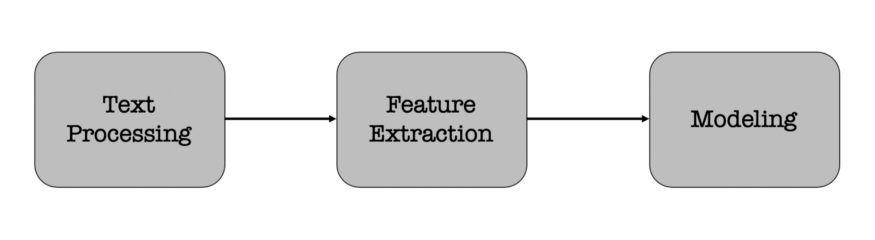</img>

Each stage transforms text in some way and produces an intermediate result that the next stage needs. For example,
- Text Processing — take raw input text, clean it, normalize it, and convert it into a form that is suitable for feature extraction.
- Feature Extraction: Extract and produce feature representations that are appropriate for the type of NLP task you are trying to accomplish and the type of model you are planning to use.
- Modeling: Design a model, fit its parameters to training data, use an optimization procedure, and then use it to make predictions about unseen data.

## 1.1 Text Processing
Text processing is first stage of NLP pipeline that discusses how text data extracted from different sources is prepared for the next stage — feature extraction.
- Cleaning — The first step in text processing is to clean the data. i.e., removing irrelevant items, such as HTML tags. This can be done in many ways. Example includes using regular expressions, beautiful soup library, CSS selector, etc.
- Normalization — The cleaned data is then normalized by converting all words to lowercase and removing punctuation and extra spaces
- Tokenization — The normalized data is split into words, also known as tokens
- Stop Words removal — After splitting the data into words, the most common words (a, an, the, etc.), also known as stop words are removed
- Parts of Speech Tagging — The parts of speech are identified for the remaining words
- Named Entity Recognition — The next step is to recognize the named entities in the data
- Stemming and Lemmatization — Converting words into their canonical / dictionary forms, using stemming and lemmatization.

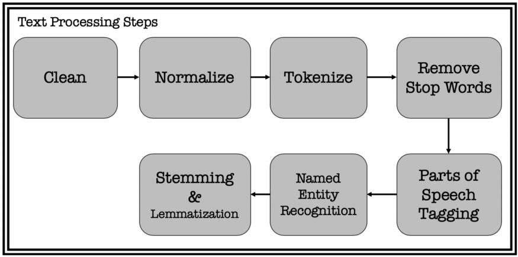</img>

### Tokenization
In essence, it’s the task of cutting a text into pieces called tokens, and at the same time throwing away certain characters, such as punctuation. Examples:
```text
Words are flowing out like endless rain into a paper cup,
They slither while they pass, they slip away across the universe
```
Following our example, the result of tokenization would be:

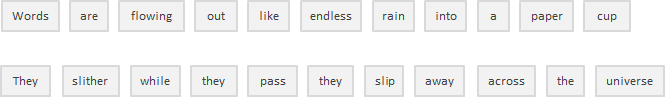</img>

### Stop Words removal
Includes getting rid of common language articles, pronouns and prepositions such as “and”, “the” or “to” in English. In this process some very common words that appear to provide little or no value to the NLP objective are filtered and excluded from the text to be processed, hence removing widespread and frequent terms that are not informative about the corresponding text.

Stop words can be safely ignored by carrying out a lookup in a pre-defined list of keywords, freeing up database space and improving processing time.

**There is no universal list of stop words.** These can be pre-selected or built from scratch. A potential approach is to begin by adopting pre-defined stop words and add words to the list later on. Nevertheless it seems that the general trend over the past time has been to go from the use of large standard stop word lists to the use of no lists at all.

The thing is stop words removal can wipe out relevant information and modify the context in a given sentence. For example, if we are performing a sentiment analysis we might throw our algorithm off track if we remove a stop word like “not”. Under these conditions, you might select a minimal stop word list and add additional terms depending on your specific objective.

### Part of Speech Tagging
This step involved taking each word from the previous step and classify it as to what part of speech it represents. This is an essential step for identifying the meaning behind a text. Identifying the nouns allows us to figure out who or what the given text is about. Then the verbs and adjectives let us understand what entities do, or how they are described, or any other meaning we can get from a text. PoS Tagging is a difficult problem but it has mostly been solved and implementations for this can be found in most of the modern Machine Learning libraries and tools.

### Named Entity Recognition — NER
This task refers to identifying the names in a sentence and correctly classify it against a list of predefined categories. Such categories may involve: Persons, Organisations, Locations, Time, Quantities and so on. Lists of categories may be tailored for your own particular use case, but in general, almost everybody needs at least these categories to be correctly identified.
There are many implementations for this kind of problem and models build recently have achieved near-human performance. Basically, this step is also divided in two substasks: correctly identify the names in a sentence and then classify each name according to your list of categories.

### Stemming
The problem is that affixes can create or expand new forms of the same word (called inflectional affixes), or even create new words themselves (called derivational affixes). In English, prefixes are always derivational (the affix creates a new word as in the example of the prefix “eco” in the word “ecosystem”), but suffixes can be derivational (the affix creates a new word as in the example of the suffix “ist” in the word “guitarist”) or inflectional (the affix creates a new form of word as in the example of the suffix “er” in the word “faster”).

how can we tell the difference and chop the right bit?

</img>

A possible approach is to consider a list of common affixes and rules (Python and R languages have different libraries containing affixes and methods) and perform stemming based on them, but of course this approach presents limitations. Since stemmers use algorithmics approaches, the result of the stemming process may not be an actual word or even change the word (and sentence) meaning. To offset this effect you can edit those predefined methods by adding or removing affixes and rules, but you must consider that you might be improving the performance in one area while producing a degradation in another one. Always look at the whole picture and test your model’s performance.

### Lemmatization
Has the objective of reducing a word to its base form and grouping together different forms of the same word. For example, verbs in past tense are changed into present (e.g. “went” is changed to “go”) and synonyms are unified (e.g. “best” is changed to “good”), hence standardizing words with similar meaning to their root. Although it seems closely related to the stemming process, lemmatization uses a different approach to reach the root forms of words.

For example, the words “running”, “runs” and “ran” are all forms of the word “run”, so “run” is the lemma of all the previous words.

</img>

Lemmatization also takes into consideration the context of the word in order to solve other problems like disambiguation, which means it can discriminate between identical words that have different meanings depending on the specific context. Think about words like “bat” (which can correspond to the animal or to the metal/wooden club used in baseball) or “bank” (corresponding to the financial institution or to the land alongside a body of water). By providing a part-of-speech parameter to a word ( whether it is a noun, a verb, and so on) it’s possible to define a role for that word in the sentence and remove disambiguation.

As you might already pictured, lemmatization is a much more **resource-intensive** task than performing a stemming process. At the same time, since it requires more knowledge about the language structure than a stemming approach, it demands more computational power than setting up or adapting a stemming algorithm.

In conclusion:
- Stemming is a process in which a word is reduced to its stem/root form. i.e., the word running, runs, etc.. can all be reduced to “run”.
- Lemmatization is another technique used to reduce words to a normalized form. In this case, the transformation actually uses a dictionary to map different variants of a word to its root. With this approach, the non-trivial inflections such as is, are, was, were, are mapped back to root ‘be’.

## 1.2 Feature Extraction/representation
Now the text is normalized, can it be fed into a statistical or machine learning model? Not exactly. Here’s why: Text data is represented on modern computers using an encoding such as ASCII or Unicode that maps every character to a number. Computer stores and transmits these values as binary, zeros and ones, which have an implicit ordering. Individual characters don’t carry much meaning at all and can mislead the NLP algorithms. It is words, that are to be considered , but computers don’t have a standard representation for words. Internally words are just sequences of of ASCII or Unicode values, but they don’t capture the relationship between words.

Compare text with computer representation of image data. For image data, pixels are used where each pixel has relative intensity of light at that spot in image. Two pixels with similar values are perceptually similar. So how a similar approach for text data can be developed, so that text can be used as features for modeling?

**This depends on what model is being used and the problem/task.** For document level tasks such as sentiment analysis, per document representations such as bag-of-words (BOW) or doc2vec representations can be used. For tasks involving individual words or phrases such as text generation or machine translation, a word level representation such as word2vec or glove can be used.

**Text representations can be broadly classified into two sections:**
- Discrete text representations: One-Hot encoding, Bag-of-words representation (BOW), Basic BOW — CountVectorizer, Advanced BOW — TF-IDF.
- Distributed/Continuous text representations: Co-Occurrence matrix, Word2Vec, GloVe.

### 1.2.1 one-hot encoding
In traditional NLP era (before deep learning) text representation was built on a basic idea, which is one-hot encodings, where a sentence is represented as a matrix of shape (NxN) where N is the number of unique tokens in the sentence, for example in the above picture, each word is represented as sparse vectors (mostly zeroes) except one cell (could be one, or the number of occurrences of the word in the sentence). This approach has two significant drawbacks; 
- the first one is the huge memory capacity issues (hugely sparse representation)
- the second one is its lack of meaning representation, such that it can’t derive similarities between words (e.g., school and book).

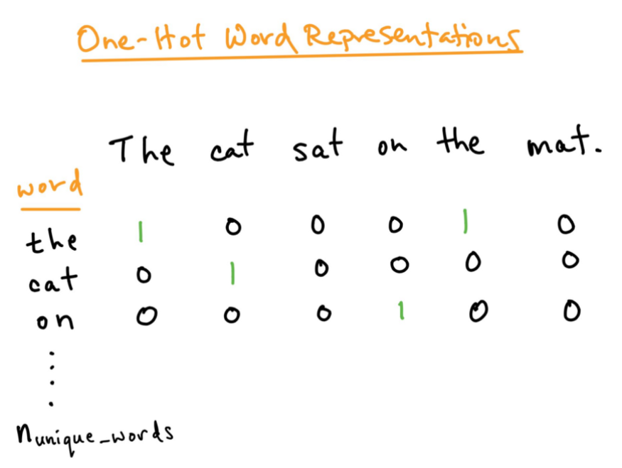</img>

### 1.2.2 Bag of words (BOW) model
Basically it creates an occurrence matrix for the sentence or document, disregarding grammar and word order. These word frequencies or occurrences are then used as features for training a classifier.

To bring a short example I took the first sentence of the song “Across the Universe” from The Beatles:
```text
Words are flowing out like endless rain into a paper cup,
They slither while they pass, they slip away across the universe
```
Now let’s count the words:

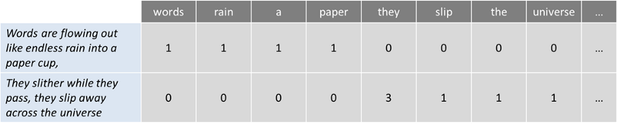</img>

This approach may reflect several downsides like the absence of semantic meaning and context, and the facts that stop words (like “the” or “a”) add noise to the analysis and some words are not weighted accordingly (“universe” weights less than the word “they”).

#### Term Frequency — Inverse Document Frequency (TF-IDF)
To solve this problem, one approach is to rescale the frequency of words by how often they appear in all texts (not just the one we are analyzing) so that the scores for frequent words like “the”, that are also frequent across other texts, get penalized. This approach to scoring is called “Term Frequency — Inverse Document Frequency” (TFIDF), and improves the bag of words by weights. Through TFIDF frequent terms in the text are “rewarded” (like the word “they” in our example), but they also get “punished” if those terms are frequent in other texts we include in the algorithm too. On the contrary, this method highlights and “rewards” unique or rare terms considering all texts. Nevertheless, this approach still has no context nor semantics.
- Positional information of the word is still not captured in this representation
- TF-IDF is highly corpus dependent. A matrix representation generated out of cricket data cannot be used for football or volleyball. Therefore, there is a need to have high quality training data

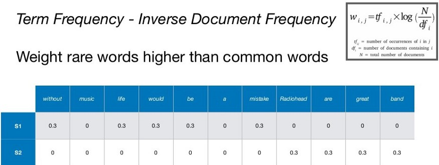</img>

### 1.2.3 Word2Vec
In 2013, researchers from Google (lead by Thomas Mikolov), has invented a new model for text representation (which was revolutionary in NLP), called word2vec, a shallow, deep learning model which can represent words in dense vectors, and capture semantic meaning between related terms (e.g., Paris and France, Madrid and Spain). Further research has built on top of word2vec, such as GloVe, fastText.

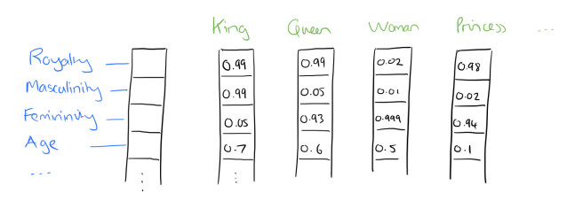</img>

word2vec constructs the vector representation via 2 methods/techniques:
- CBOW — tries to predict the middle word in the context of surrounding word. So in simple terms, it tries to fill in the blanks as to what word will be more suitable to fit given the context/surrounding words. More efficient with smaller datasets. Fast training time compared to Skip-Gram
- Skip-Gram — Tries to predict the surrounding context words from a target word (opposite of CBOW). Tends to perform better in larger dataset but larger training time

Word2vec is capable of capturing multiple degrees of similarity between words using simple vector arithmetic. Patterns like “man is to woman as king is to queen” can be obtained through arithmentic operations like “king” — “man” + “woman” = “queen” where “queen” will be closest vector representation of the word itself. It is also capable of syntatic relationship like present & past tense & semantic relationships like country-capital relationships.

- Advantages:
    - Capable of capturing relationship between different words including their syntactic & semantic relationships
    - Size of the embedding vector is small & flexible, unlike all the previous algorithms discussed where the size of embedding is proportional to vocabulary size
    - Since its unsupervised, human effort in tagging the data is less
- Disadvantages:
    - Word2Vec cannot handle out-of-vocabulary words well. It assigns a random vector representation for OOV words which can be suboptimal
    - It relies on local information of language words. The semantic representation of a word relies only on its neighbours & can prove suboptimal
    - Parameters for training on new languages cannot be shared. If you want to train word2vec on a new language, you have to start from scratch
    - Requires a comparatively larger corpus for the network to converge (especially if using skip-gram

### 1.2.4 GloVe
It tries to overcome the 2nd disadvantage of word2vec mentioned above by trying to learn both local & global statistics of a word to represent it. i:e it tries to encompass the best of count based technique (co-occurrence matrix) & prediction based technique (Word2Vec) and hence is also referred to as a hybrid technique for continuous word representation.

In GloVe, we try to enforce the below relationship: $v_{i}^{T} v_{j}=\log P(i \mid j)$, which can be re-written as, $v_{i}^{T} v_{j}=\log \left(X_{i_{j}}\right)-\log \left(X_{i}\right)$.

where, $v_{i}^{T}=$ transpose of the $i^{t h}$ word representation, $v_{j}=$ representation of the $j^{t h}$ word $P(i \mid j)=$ probability of word $j$ appearing in the context of word $i$ $X_{i j}=c o-$ occurrence between words $i$ and $j$, $X_{i}=\sum X_{i_{j}}$.

- Advantages
    - It tends to perform better then word2vec in analogy tasks
    - It considers word pair to word pair relationship while constructing the vectors & hence tend to add more meaning to the vectors when compared to vectors constructed from word-word relationships
    - GloVe is easier to parallelise compared to Word2Vec hence shorter training time
- Disadvantages
    - Because it uses co-occurrence matrix & global information, memory cost is more in GloVe compared to word2vec
    - Similar to word2vec, it does not solve the problem of polysemous words since words & vectors have one-to-one relationship

#### N-grams 
N-grams are the combination of multiple words used together, Ngrams with N=1 are called unigrams. Similarly, bigrams (N=2), trigrams (N=3) and so on can also be used. N-grams can be used when we want to preserve sequence information in the document, like what word is likely to follow the given one. Unigrams don’t contain any sequence information because each word is taken individually.

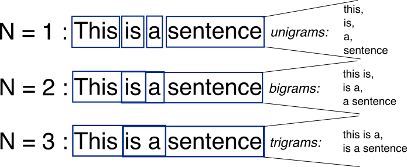</img>

### 1.2.5 Vector Similarity
Generated word embeddings need to be compared in order to get semantic similarity between two vectors. There are few statistical methods are being used to find the similarity between two vectors. which are:
- Cosine Similarity
- Word mover’s distance
- Euclidean distance
#### Cosine Similarity
It is the most widely used method to compare two vectors. It is a dot product between two vectors. We would find the cosine angle between the two vectors. For degree 0, cosine is 1 and it is less than 1 for any other angle.

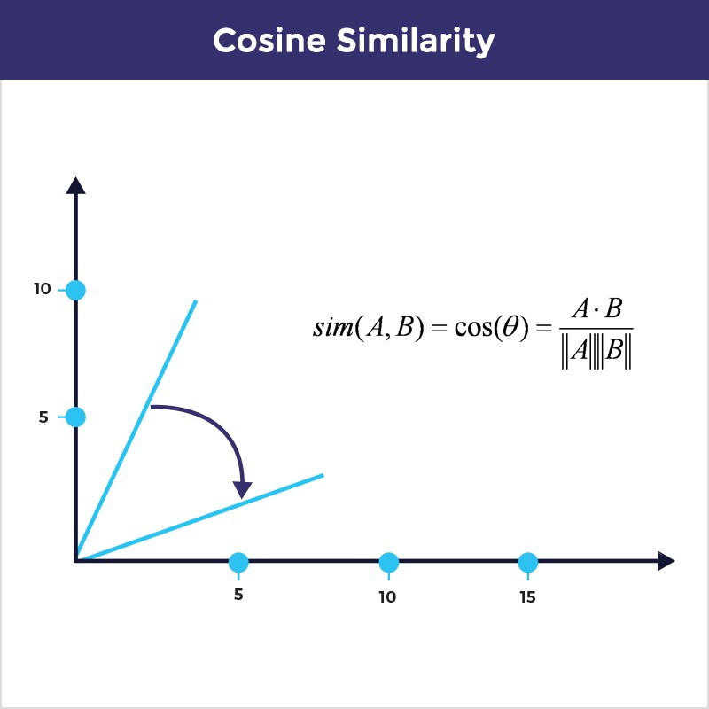</img>

#### Word mover’s distance
This uses the word embeddings of the words in two texts to measure the minimum distance that the words in one text need to “travel” in semantic space to reach the words in the other text.

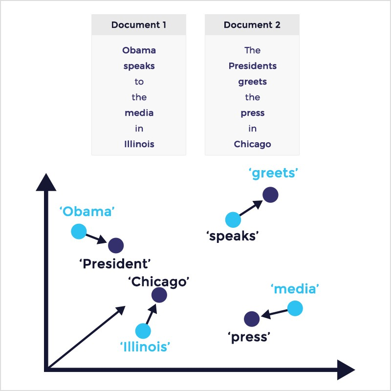</img>

#### The Euclidean distance
Euclidean distance between two points is the length of the path connecting them. The Pythagorean theorem gives this distance between two points. If the length of the sentence is increased between two sentences then by the euclidean distance they are different even though they have the same meaning.

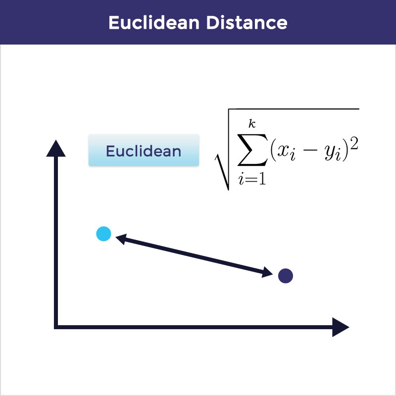</img>

## 1.3 Modeling
The final stage of the NLP pipeline is modeling, which includes designing a statistical or machine learning model, fitting its parameters to training data, using an optimization procedure, and then using it to make predictions about unseen data.

Most underlying frameworks in NLP applications rely on sequence-to-sequence (seq2seq) models in which not only the input but also the output is represented as a sequence.

The most common seq2seq framework is comprised of an encoder and a decoder. The encoder ingests the sequence of input data and generates a mid-level output which is subsequently consumed by the decoder to produce the series of final outputs. The encoder and decoder are usually implemented via a series of Recurrent Neural Networks or LSTM cells.

### 1.3.1 Recurrent Neural Network
Recurrent Neural Network remembers the past and it’s decisions are influenced by what it has learnt from the past. Note: Basic feed forward networks “remember” things too, but they remember things they learnt during training. For example, an image classifier learns what a “1” looks like during training and then uses that knowledge to classify things in production. Recurrent neural networks are used in speech recognition, language translation, stock predictions; It’s even used in image recognition to describe the content in pictures.

Now that we have the intuition, our input layer to the neural network is determined by our input dataset. Each row of input data is used to generate the hidden layer (via forward propagation). Each hidden layer is then used to populate the output layer (assuming only 1 hidden layer). As we just saw, memory means that the hidden layer is a combination of the input data and the previous hidden layer.

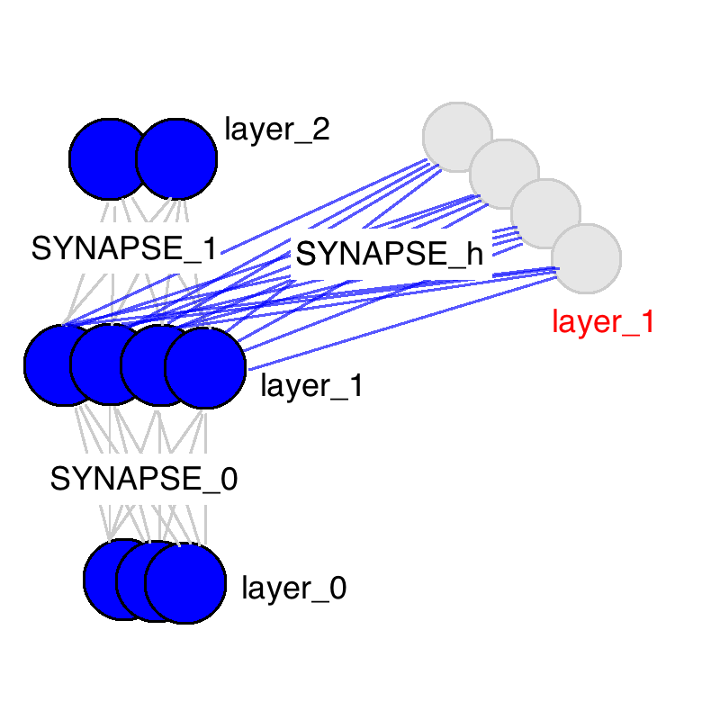</img>

SYNAPSE_0 propagates the input data to the hidden layer. SYNAPSE_1 propagates the hidden layer to the output data. The new matrix (SYNAPSE_h....the recurrent one), propagates from the hidden layer (layer_1) to the hidden layer at the next timestep (still layer_1).

</img>

The first is exclusively influenced by the input data. The second one is a mixture of the first and second inputs. This continues on. 

So how do recurrent neural networks learn? Check out this graphic. Black is the prediction, errors are bright yellow, derivatives are mustard colored.

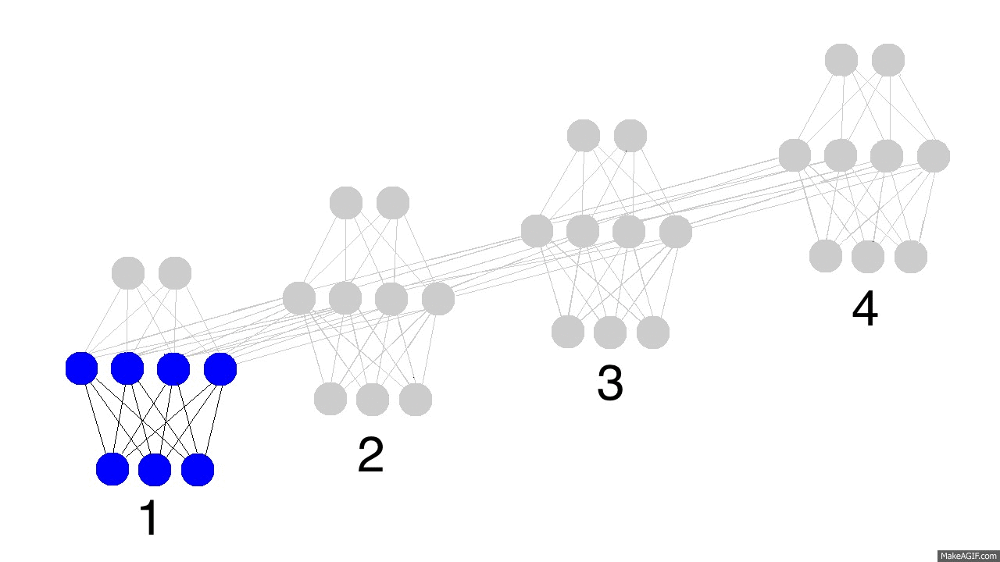</img>

They learn by fully propagating forward from 1 to 4 (through an entire sequence of arbitrary length), and then backpropagating all the derivatives from 4 back to 1. You can also pretend that it's just a funny shaped normal neural network, except that we're re-using the same weights (synapses 0,1,and h) in their respective places. Other than that, it's normal backpropagation.

### 1.3.2 Long Short Term Memory networks (LSTM)
In theory, RNNs are absolutely capable of handling such “long-term dependencies.” A human could carefully pick parameters for them to solve toy problems of this form. Sadly, in practice, RNNs don’t seem to be able to learn them. That's why LSTM comes out!

LSTMs are explicitly designed to avoid the long-term dependency problem. Remembering information for long periods of time is practically their default behavior, not something they struggle to learn!

All recurrent neural networks have the form of a chain of repeating modules of neural network. In standard RNNs, this repeating module will have a very simple structure, such as a single tanh layer.

</img>

LSTMs also have this chain like structure, but the repeating module has a different structure. Instead of having a single neural network layer, there are four, interacting in a very special way.

</img>

Let’s go back to our example of a language model trying to predict the next word based on all the previous ones. In such a problem, the cell state might include the gender of the present subject, so that the correct pronouns can be used. When we see a new subject, we want to forget the gender of the old subject.

</img>

The next step is to decide what new information we’re going to store in the cell state. This has two parts. First, a sigmoid layer called the “input gate layer” decides which values we’ll update. Next, a tanh layer creates a vector of new candidate values, $\hat{C}_t$, that could be added to the state. In the next step, we’ll combine these two to create an update to the state. In the example of our language model, we’d want to add the gender of the new subject to the cell state, to replace the old one we’re forgetting.

</img>

It’s now time to update the old cell state, $C_{t−1}$, into the new cell state Ct. The previous steps already decided what to do, we just need to actually do it.

We multiply the old state by $f_t$, forgetting the things we decided to forget earlier. Then we add $i_t∗\hat{C}_t$. This is the new candidate values, scaled by how much we decided to update each state value.

In the case of the language model, this is where we’d actually drop the information about the old subject’s gender and add the new information, as we decided in the previous steps.

</img>

Finally, we need to decide what we’re going to output. This output will be based on our cell state, but will be a filtered version. First, we run a sigmoid layer which decides what parts of the cell state we’re going to output. Then, we put the cell state through tanh (to push the values to be between −1 and 1) and multiply it by the output of the sigmoid gate, so that we only output the parts we decided to.

For the language model example, since it just saw a subject, it might want to output information relevant to a verb, in case that’s what is coming next. For example, it might output whether the subject is singular or plural, so that we know what form a verb should be conjugated into if that’s what follows next.

</img>

Here I do not mention other variants of RNN, because RNN and LSTM are the most fundamental ones.

# 2. Toy Example
## 2.1 Text Processing
1. import
```python
import re
import nltk
import string
import itertools
from nltk.corpus import stopwords
from nltk.stem import PorterStemmer
from nltk.stem import WordNetLemmatizer

nltk.download('words')
nltk.download('punkt')
nltk.download('averaged_perceptron_tagger')
nltk.download('maxent_ne_chunker')

from nltk import pos_tag, ne_chunk

import warnings

warnings.filterwarnings('ignore')
```

2. cleaning
```python
def clean_text(text):

    # Remove URLs
    text = re.sub(r"http\S+", "", text)
    
    # Remove emails
    text = re.sub(r'[\w\.-]+@[\w\.-]+', ' ', text, flags=re.MULTILINE)
    
    print('\nCleaning output:\n')
    print(text)
    
    return text
```
3. Normalization
```python
def normailze_text(text):
    
    # Convert to lowercase
    text = text.lower()
    
    # Remove extra characters
    text = ''.join(''.join(s)[:2] for _, s in itertools.groupby(text))
    
    # Remove punctuation characters
    text = re.sub(r"[^a-zA-Z0-9]", " ", text) 
    
    # Remove symbols
    text = re.sub(r'[^A-Za-z\s]',r'',text)
    text = re.sub(r'\n',r'',text)
    
    print('\nNormalization output:\n')
    print(text)
    
    return text
```

4. Tokenization
```python
def tokenize_text(text):
    
    #Tokenize words
    tokens = nltk.word_tokenize(text)
    print('\nTokenization output:\n')
    print(tokens)
    
    return tokens
```
5. stop words removal
```python
def remove_stopwords(tokens):
    
    stop_words = stopwords.words('english')
    token_list = []
    
    for word in tokens:
        if not word in stop_words:
            token_list.append(word)
            
    print('\nOutput after removing stop words:\n')
    
    return token_list
```
6. Parts of speech tagging & Named Entity Recognition
```python
def pos_ner(tokens):
    
    #POS tagging
    pos = pos_tag(tokens)
    
    print('\nParts of Speech Tagging:\n')
    print(pos)
    
    #NER
    ner = ne_chunk(pos)
    
    print('\nNamed Entity Recognition:\n')
    print(ner)
```
7. stemming and lemmatizing tokens
```python
def stem_lem_words(tokens):
    
    # Stemming tokens
    tokens = [stemmer.stem(token) for token in tokens]
    
    print('\nStemming Output:\n')
    print(tokens)
    
    #Lemmatizing tokens
    tokens = [lemmatizer.lemmatize(token, pos='v') for token in tokens]

    print('\nLemmatizing Output:\n')
    print(tokens)
    
    return tokens
```
8. main
```python
def main(text):
    
    # Clean Text
    text = clean_text(text)
    
    # Normalize Text
    text = normailze_text(text)
    
    # Tokenize Text
    tokens = tokenize_text(text)
    
    # Remove Stop words
    tokens = remove_stopwords(tokens)
    
    # Display POS & NER
    pos_ner(tokens)
    
    # Stem & Lemmatize Tokens
    tokens = stem_lem_words(tokens)

    print('\nThe input text after processing:\n')
    
    return tokens

inp_text = "The first time you see The Second Renaissance it may look boring. Look at it at least twice and definitely watch part 2. It will change your view of the matrix. Are the human people the ones who started the war ? Is AI a bad thing ? Learn more at https://www.ai.com/test"

print(main(inp_text))
```
9. output
```text
Cleaning output:

The first time you see The Second Renaissance it may look boring. Look at it at least twice and definitely watch part 2. It will change your view of the matrix. Are the human people the ones who started the war ? Is AI a bad thing ? Learn more at 

Normalization output:

the first time you see the second renaissance it may look boring  look at it at least twice and definitely watch part   it will change your view of the matrix  are the human people the ones who started the war   is ai a bad thing   learn more at 

Tokenization output:

['the', 'first', 'time', 'you', 'see', 'the', 'second', 'renaissance', 'it', 'may', 'look', 'boring', 'look', 'at', 'it', 'at', 'least', 'twice', 'and', 'definitely', 'watch', 'part', 'it', 'will', 'change', 'your', 'view', 'of', 'the', 'matrix', 'are', 'the', 'human', 'people', 'the', 'ones', 'who', 'started', 'the', 'war', 'is', 'ai', 'a', 'bad', 'thing', 'learn', 'more', 'at']

Output after removing stop words:


Parts of Speech Tagging:

[('first', 'JJ'), ('time', 'NN'), ('see', 'VB'), ('second', 'JJ'), ('renaissance', 'NN'), ('may', 'MD'), ('look', 'VB'), ('boring', 'VBG'), ('look', 'NN'), ('least', 'JJS'), ('twice', 'RB'), ('definitely', 'RB'), ('watch', 'JJ'), ('part', 'NN'), ('change', 'NN'), ('view', 'NN'), ('matrix', 'JJ'), ('human', 'JJ'), ('people', 'NNS'), ('ones', 'NNS'), ('started', 'VBD'), ('war', 'NN'), ('ai', 'NN'), ('bad', 'JJ'), ('thing', 'NN'), ('learn', 'NN')]

Named Entity Recognition:

(S
  first/JJ
  time/NN
  see/VB
  second/JJ
  renaissance/NN
  may/MD
  look/VB
  boring/VBG
  look/NN
  least/JJS
  twice/RB
  definitely/RB
  watch/JJ
  part/NN
  change/NN
  view/NN
  matrix/JJ
  human/JJ
  people/NNS
  ones/NNS
  started/VBD
  war/NN
  ai/NN
  bad/JJ
  thing/NN
  learn/NN)

Stemming Output:

['first', 'time', 'see', 'second', 'renaiss', 'may', 'look', 'bore', 'look', 'least', 'twice', 'definit', 'watch', 'part', 'chang', 'view', 'matrix', 'human', 'peopl', 'one', 'start', 'war', 'ai', 'bad', 'thing', 'learn']

Lemmatizing Output:

['first', 'time', 'see', 'second', 'renaiss', 'may', 'look', 'bore', 'look', 'least', 'twice', 'definit', 'watch', 'part', 'chang', 'view', 'matrix', 'human', 'peopl', 'one', 'start', 'war', 'ai', 'bad', 'thing', 'learn']

The input text after processing:

['first', 'time', 'see', 'second', 'renaiss', 'may', 'look', 'bore', 'look', 'least', 'twice', 'definit', 'watch', 'part', 'chang', 'view', 'matrix', 'human', 'peopl', 'one', 'start', 'war', 'ai', 'bad', 'thing', 'learn']
```

## 2.2 Feature Extraction
Below, we'll look at three useful methods of vectorizing text.
- CountVectorizer - Bag of Words
- TfidfTransformer - TF-IDF values
- TfidfVectorizer - Bag of Words AND TF-IDF values

```python
import re
import nltk
from nltk.corpus import stopwords
from nltk.stem.wordnet import WordNetLemmatizer
from nltk.tokenize import word_tokenize

nltk.download('punkt')
nltk.download('stopwords')
nltk.download('wordnet')

corpus = ["The first time you see The Second Renaissance it may look boring.",
        "Look at it at least twice and definitely watch part 2.",
        "It will change your view of the matrix.",
        "Are the human people the ones who started the war?",
        "Is AI a bad thing ?"]

stop_words = stopwords.words("english")
lemmatizer = WordNetLemmatizer()

def tokenize(text):
    # normalize case and remove punctuation
    text = re.sub(r"[^a-zA-Z0-9]", " ", text.lower())
    
    # tokenize text
    tokens = word_tokenize(text)
    
    # lemmatize andremove stop words
    tokens = [lemmatizer.lemmatize(word) for word in tokens if word not in stop_words]

    return tokens
```
1. CountVectorizer (Bag of Words)
```python
from sklearn.feature_extraction.text import CountVectorizer

# initialize count vectorizer object
vect = CountVectorizer(tokenizer=tokenize)
# get counts of each token (word) in text data
X = vect.fit_transform(corpus)
# convert sparse matrix to numpy array to view
X.toarray()
```
2. TfidfTransformer
```python
from sklearn.feature_extraction.text import TfidfTransformer

# initialize tf-idf transformer object
transformer = TfidfTransformer(smooth_idf=False)
# use counts from count vectorizer results to compute tf-idf values
tfidf = transformer.fit_transform(X)
# convert sparse matrix to numpy array to view
tfidf.toarray()
```
3. TfidfVectorizer:
TfidfVectorizer = CountVectorizer + TfidfTransformer
```python
from sklearn.feature_extraction.text import TfidfVectorizer

# initialize tf-idf vectorizer object
vectorizer = TfidfVectorizer()
# compute bag of word counts and tf-idf values
X = vectorizer.fit_transform(corpus)
# convert sparse matrix to numpy array to view
X.toarray()
```

# 4. Application
## Sentiment Analysis
Sentiment analysis looks not just at what’s being said, but the emotion behind it. This is especially helpful for B2C businesses, such as looking at social media discussion in regards to a product. Are your customers happy with your latest product? Is there a correlation between a product and customer service? S.A. will help you there.

Today, various NLP techniques are used by companies to analyze social media posts and know what customers think about their products. Companies are also using social media monitoring to understand the issues and problems that their customers are facing by using their products. Not just companies, even the government uses it to identify potential threats related to the security of the nation.

Here are some articles you could follow:
- [Comprehensive Hands-on Guide to Twitter Sentiment Analysis with dataset and code](https://www.analyticsvidhya.com/blog/2018/07/hands-on-sentiment-analysis-dataset-python/?utm_source=blog&utm_medium=TopApplicationsofNLP)
- [Measuring Audience Sentiments about Movies using Twitter and Text Analytics](https://www.analyticsvidhya.com/blog/2017/03/measuring-audience-sentiments-about-movies-using-twitter-and-text-analytics?utm_source=blog&utm_medium=TopApplicationsofNLP)
- [Sentiment Analysis of Twitter Posts on Chennai Floods using Python](https://www.analyticsvidhya.com/blog/2017/01/sentiment-analysis-of-twitter-posts-on-chennai-floods-using-python/?utm_source=blog&utm_medium=TopApplicationsofNLP)

## Machine Translation
Machine translation is the process of using a machine to convert text from one language to another, such as through a translation app. While there are plenty of apps out there that provide direct translation, it’s attractive to see someone with the skills who can translate for specific domains, such as business or weather, to give a more fleshed-out translation. Many apps just translate word-by-word, substituting them at a very standard level, and context/sentence structure can get lost in translation.

Today, tools like Google Translate can easily convert text from one language to another language. These tools are helping numerous people and businesses in breaking the language barrier and becoming successful. This [A Must-Read NLP Tutorial on Neural Machine Translation – The Technique Powering Google Translate](https://www.analyticsvidhya.com/blog/2019/01/neural-machine-translation-keras/?utm_source=blog&utm_medium=TopApplicationsofNLP) will help you.

## Question Anwsering
Customer service and experience are the most important thing for any company. It can help the companies improve their products, and also keep the customers satisfied. But interacting with every customer manually, and resolving the problems can be a tedious task. This is where Chatbots come into the picture. Chatbots help the companies in achieving the goal of smooth customer experience.

Additionally, it can reduce the cost of hiring call center representatives for the company. Initially, chatbots were only used as a tool that solved customers’ queries, but today they have evolved into a personal companion. From recommending a product to getting feedback from the customers, chatbots can do everything.

here are some materials:
- [Learn how to Build and Deploy a Chatbot in Minutes using Rasa (IPL Case Study!)](https://www.analyticsvidhya.com/blog/2019/04/learn-build-chatbot-rasa-nlp-ipl/?utm_source=blog&utm_medium=TopApplicationsofNLP)

# 5. Library
- [HanLP: Han Language Processing](https://github.com/hankcs/HanLP): The multilingual NLP library for researchers and companies, built on PyTorch and TensorFlow 2.x, for advancing state-of-the-art deep learning techniques in both academia and industry. 
- [SpaCy](https://github.com/explosion/spaCy) is yet another Python library which employs machine learning and deep learning to help you with a lot of powerful feature. 
- [Gensim](https://github.com/RaRe-Technologies/gensim): Gensim is a Python library for topic modelling, document indexing and similarity retrieval with large corpora which depends on Numpy and Scipy.
- [AllenNLP](https://github.com/allenai/allennlp): An open-source NLP research library, built on PyTorch.
- TextBlob (https://github.com/sloria/TextBlob)
- [NLTK](https://github.com/nltk/nltk) Natural Language Toolkit is a Python library which is mainly used in research and education. It includes many steps in the pipeline with models which are ready to test and use.
- [CoreNLP](https://github.com/stanfordnlp/CoreNLP) is another Python library which provides a wide range of tools for understanding natural language.
- [nlp-tutorial](https://github.com/graykode/nlp-tutorial): nlp-tutorial is a tutorial for who is studying NLP(Natural Language Processing) using Pytorch. Most of the models in NLP were implemented with less than 100 lines of code.(except comments or blank lines)

# 6. Research Survey
- [Natural Language Processing Advancements By Deep Learning: A Survey](https://arxiv.org/abs/2003.01200)
