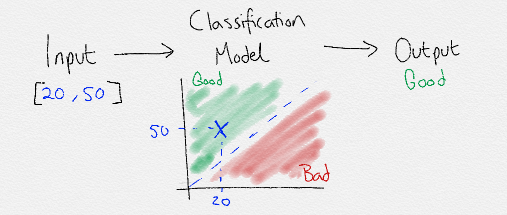
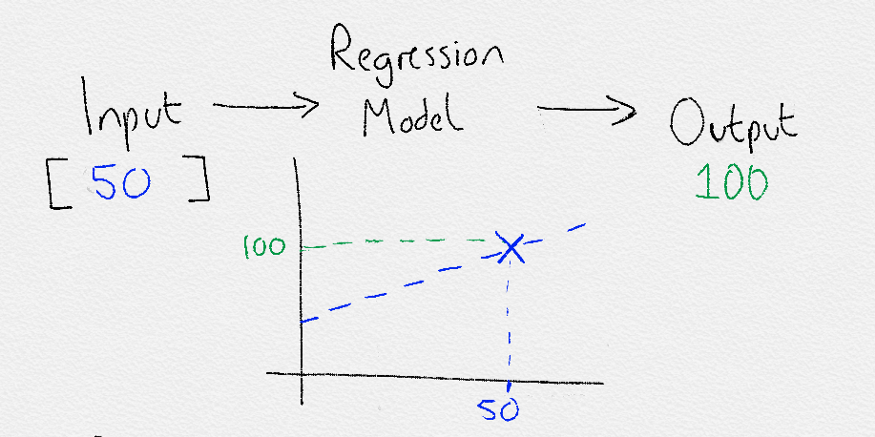
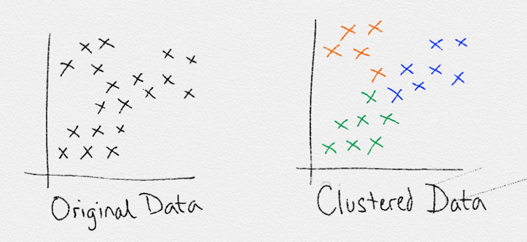
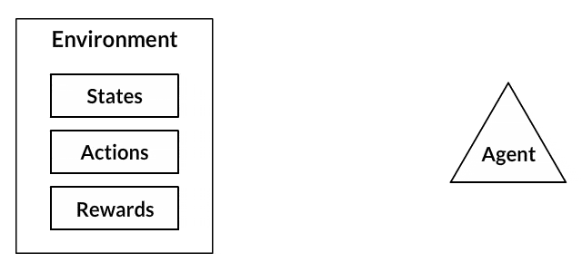

# Overview of Machine learning and its algorithm

Machine learning is a tool for turning information into knowledge. In the past 50 years, there has been an explosion of data. This mass of data is useless unless we analyse it and find the patterns hidden within. Machine learning techniques are used to automatically find the valuable underlying patterns within complex data that we would otherwise struggle to discover. The hidden patterns and knowledge about a problem can be used to predict future events and perform all kinds of complex decision making.

# Machine Learning Approaches
There are many approaches that can be taken when conducting Machine Learning. They are usually grouped into the areas listed below. Supervised and Unsupervised are well established approaches and the most commonly used. Semi-supervised and Reinforcement Learning are newer and more complex but have shown impressive results.

The No Free Lunch theorem is famous in Machine Learning. It states that there is no single algorithm that will work well for all tasks. Each task that you try to solve has it’s own idiosyncrasies. Therefore, there are lots of algorithms and approaches to suit each problems individual quirks. Plenty more styles of Machine Learning and AI will keep being introduced that best fit different problems.

## 1. Supervised Learning
In supervised learning, the goal is to learn the mapping (the rules) between a set of inputs and outputs. For example, the inputs could be the weather forecast, and the outputs would be the visitors to the beach. The goal in supervised learning would be to learn the mapping that describes the relationship between temperature and number of beach visitors.

### 1.1 Classification
The output from a supervised Machine Learning model could be a category from a finite set e.g [low, medium, high] for the number of visitors to the beach:
`Input [temperature=20] -> Model -> Output = [visitors=high]`
When this is the case, it’s is deciding how to classify the input, and so is known as classification.

The lines drawn between classes are known as the decision boundaries. The entire area that is chosen to define a class is known as the decision surface. The decision surface defines that if a data point falls within its boundaries, it will be assigned a certain class.

### 1.2 Regression
Alternatively, the output could be a real-world scalar (output a number):
`Input [temperature=20] -> Model -> Output = [visitors=300]`
When this is the case, it is known as regression.

Regression is another form of supervised learning. The difference between classification and regression is that regression outputs a number rather than a class. Therefore, regression is useful when predition.

Both the classification and regression supervised learning techniques can be extended to much more complex tasks. For example, tasks involving speech and audio. Image classification, object detection and chat bots are some examples.

A recent example shown below uses a model trained with supervised learning to realistically fake videos of people talking. You might be wondering how does this complex image based task relate to classification or regression? Well, it comes back to everything in the world, even complex phenomenon, being fundamentally described with math and numbers. In this example, a neural network is still only outputting numbers like in regression. But in this example the numbers are the numerical 3d coordinate values of a facial mesh.

<video src="https://youtu.be/ZtP3gl_2kBM" controls="controls" width="500" height="300">Your user agent does not support the HTML5 Video element.</video>

# 2. unsupervised Learning
In unsupervised learning, only input data is provided in the examples. There are no labelled example outputs to aim for. But it may be surprising to know that it is still possible to find many interesting and complex patterns hidden within data without any labels.

## 2.1 Cluster
Unsupervised learning is mostly used for clustering. Clustering is the act of creating groups with differing characteristics. Clustering attempts to find various subgroups within a dataset.

## 2.2 Association
In Association Learning you want to uncover the rules that describe your data. For example, if a person watches video A they will likely watch video B. Association rules are perfect for examples such as this where you want to find related items.
## 2.3 Amomaly Detection
The identification of rare or unusual items that differ from the majority of data. For example, your bank will use this to detect fraudulent activity on your card. Your normal spending habits will fall within a normal range of behaviors and values. But when someone tries to steal from you using your card the behavior will be different from your normal pattern. Anomaly detection uses unsupervised learning to separate and detect these strange occurrences.
## 2.4 Dimensionality Reduction
Dimensionality reduction aims to find the most important features to reduce the original feature set down into a smaller more efficient set that still encodes the important data.

For example, in predicting the number of visitors to the beach we might use the temperature, day of the week, month and number of events scheduled for that day as inputs. But the month might actually be not important for predicting the number of visitors.

Irrelevant features such as this can confuse a Machine Leaning algorithms and make them less efficient and accurate. By using dimensionality reduction, only the most important features are identified and used. Principal Component Analysis (PCA) is a commonly used technique.

## 3. Semi-supervised learning
Semi-supervised learning is a mix between supervised and unsupervised approaches. The learning process isn’t closely supervised with example outputs for every single input, but we also don’t let the algorithm do its own thing and provide no form of feedback.

## 3.1 Generative Adversarial Networks
GANs use two neural networks, a generator and discriminator. The generator generates output and the discriminator critiques it. By battling against each other they both become increasingly skilled. By using a network to both generate input and another one to generate outputs there is no need for us to provide explicit labels every single time and so it can be classed as semi-supervised.

A perfect example is in medical scans, such as breast cancer scans. A trained expert is needed to label these which is time consuming and very expensive. Instead, an expert can label just a small set of breast cancer scans, and the semi-supervised algorithm would be able to leverage this small subset and apply it to a larger set of scans.

<video src="https://youtu.be/D4C1dB9UheQ" controls="controls" width="500" height="300">Your user agent does not support the HTML5 Video element.</video>

# 4. Reinforcement Learning
RL doesn’t use labels as such, and instead uses rewards to learn. Think of it like training a dog, good behaviours are rewarded with a treat and become more common. Bad behaviours are punished and become less common. This reward-motivated behaviour is key in reinforcement learning.

One of the most exciting parts of Reinforcement Learning is that is a first step away from training on static datasets, and instead of being able to use dynamic, noisy data-rich environments. 

Games are very popular in Reinforcement Learning research. They provide ideal data-rich environments. The scores in games are ideal reward signals to train reward-motivated behaviours. Additionally, time can be sped up in a simulated game environment to reduce overall training time. A Reinforcement Learning algorithm just aims to maximise its rewards by playing the game over and over again. 

<video src="https://youtu.be/Ih8EfvOzBOY" controls="controls" width="500" height="300">Your user agent does not support the HTML5 Video element.</video>
