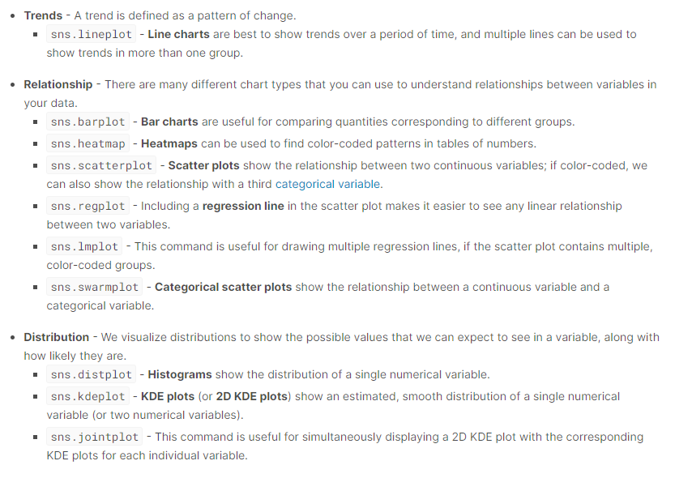
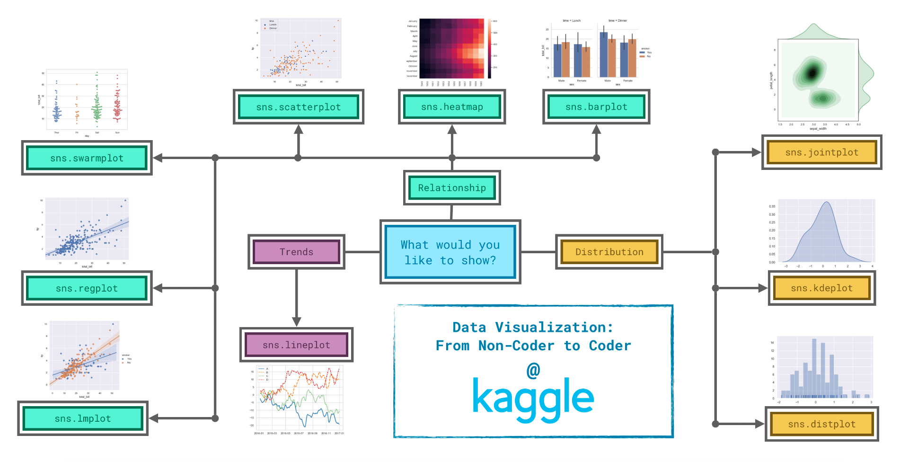

# Awesome-Machine-Learning
This [blog](https://github.com/Billy1900/Awesome-Machine-Learning/blob/main/Overview-of-ML/overview-ML.md) helps beginners get an overview of machine learning and its algorithms. And this [video](https://youtu.be/aircAruvnKk) will definitely give you a good intuitive understanding of machine learning.


## 1. Introduction of Machine Learning Theory
### 1.1 Courses
There are three courses I recommend,
- [CS221: Artificial Intelligence: Principles and Techniques](https://stanford-cs221.github.io/spring2020/): In this course, you will learn the foundational principles that drive these applications and practice implementing some of these systems. Specific topics include machine learning, search, game playing, Markov decision processes, constraint satisfaction, graphical models, and logic.
- [Machine Learning from Andrew Ng](https://www.coursera.org/learn/machine-learning): This course provides a broad introduction to machine learning, datamining, and statistical pattern recognition. Topics include: (i) Supervised learning (parametric/non-parametric algorithms, support vector machines, kernels, neural networks). (ii) Unsupervised learning (clustering, dimensionality reduction, recommender systems, deep learning). (iii) Best practices in machine learning (bias/variance theory; innovation process in machine learning and AI). 
- [CS229: Machine Learning](http://cs229.stanford.edu/): This course provides a broad introduction to machine learning and statistical pattern recognition. Topics include: supervised learning (generative/discriminative learning, parametric/non-parametric learning, neural networks, support vector machines); unsupervised learning (clustering, dimensionality reduction, kernel methods); learning theory (bias/variance tradeoffs, practical advice); reinforcement learning and adaptive control. The course will also discuss recent applications of machine learning, such as to robotic control, data mining, autonomous navigation, bioinformatics, speech recognition, and text and web data processing.
- [Deep Learning](https://www.deeplearning.ai/deep-learning-specialization/): This course is from deeplearning.ai
### 1.2 Books
- [Neural Networks and Deep Learning](http://neuralnetworksanddeeplearning.com/): Neural networks and deep learning currently provide the best solutions to many problems in image recognition, speech recognition, and natural language processing. This book will teach you many of the core concepts behind neural networks and deep learning. The pdf version is [here](https://static.latexstudio.net/article/2018/0912/neuralnetworksanddeeplearning.pdf) and the [code](https://github.com/MichalDanielDobrzanski/DeepLearningPython35).
- [Mathematics for Machine Learning](https://mml-book.github.io/): This book can be split into two parts: 1) Mathematical foundations. 2) Example machine learning algorithms that use the mathematical foundations.
- [Foundations of machine learning](https://cs.nyu.edu/~mohri/mlbook/): This graduate-level textbook introduces fundamental concepts and methods in machine learning. It describes several important modern algorithms, provides the theoretical underpinnings of these algorithms, and illustrates key aspects for their application. The authors aim to present novel theoretical tools and concepts while giving concise proofs even for relatively advanced topics.
- [Understanding Machine Learning: From Theory to Algorithms](https://www.cs.huji.ac.il/~shais/UnderstandingMachineLearning/): The book provides a theoretical account of the fundamentals underlying machine learning and the mathematical derivations that transform these principles into practical algorithms.

## 2. Diving into the general theory
- [Convex Optimization I](https://web.stanford.edu/~boyd/cvxbook/): This course covers the ideas behind solving convex optimization problems and their applications in statistics, machine learning, signal processing, and other fields. Although many models today use non-convex goals, it helps to understand the form behind the problem of manageable optimizations.
- [CS 228: Probabilistic Graphical Models](https://cs.stanford.edu/~ermon/cs228/index.html): Probabilistic graphical models are a powerful framework for representing complex domains using probability distributions, with numerous applications in machine learning, computer vision, natural language processing and computational biology. Graphical models bring together graph theory and probability theory, and provide a flexible framework for modeling large collections of random variables with complex interactions. This course will provide a comprehensive survey of the topic, introducing the key formalisms and main techniques used to construct them, make predictions, and support decision-making under uncertainty.

## 3. Data Mining
- [CS246: Mining Massive Data Sets](http://web.stanford.edu/class/cs246/): The course will discuss data mining and machine learning algorithms for analyzing very large amounts of data. The emphasis will be on MapReduce and Spark as tools for creating parallel algorithms that can process very large amounts of data.

## 4. NLP
Natural language processing (NLP) is the intersection of computer science, linguistics and machine learning. The field focuses on communication between computers and humans in natural language and NLP is all about making computers understand and generate human language. I write a [simple overview of NLP](NLP/NLP.md). For courses, [CS224n: Natural Language Processing with Deep Learning](http://web.stanford.edu/class/cs224n/) is a good choice, free and comprehensive. Besides, I found a good tutorial -- [ML-NLP](https://github.com/NLP-LOVE/ML-NLP) from Machine learning to NLP with full code implementation and instructions.

## 5. CV
Computer Vision has become ubiquitous in our society, with applications in search, image understanding, apps, mapping, medicine, drones, and self-driving cars. First, I write [a whole overview](CV/readme.md) of Computer Vision, simple but comprehensive. For visual explanation, [CNN explainer](https://github.com/poloclub/cnn-explainer) is a good work to tell you the function of different layers. And courses I have learned, [CS231n: Convolutional Neural Networks for Visual Recognition](http://cs231n.stanford.edu/) is an excellent course from Standford, all free.

## 6. Machine learning on graphs--Graph Neural Network (GNN)
Recently, Graph Neural Network (GNN) has gained increasing popularity in various domains, including social network, knowledge graph, recommender system, and even life science. The power of GNN in modeling the dependencies between nodes in a graph enables the breakthrough in the research area related to graph analysis. This article aims to introduce the basics of Graph Neural Network and two more advanced algorithms, DeepWalk and GraphSage. There is a [Blog GNN-Learning](https://github.com/Billy1900/GNN-Learning-and-Integration) which might help you get into GNN deeply.

## 7. Reinforcement learning
Deep reinforcement learning is about taking the best actions from what we see and hear. Unfortunately, reinforcement learning RL has a high barrier in learning the concepts and the lingos. In this article, we will cover deep RL with an overview of the general landscape. Yet, we will not shy away from equations and lingos. They provide the basics in understanding the concepts deeper. Here I write [a short blog](RL/readme.md) which takes you into the RL area and provide some excellent learning materials which definitely will help you.

## 8. Conference
- NLP: ACL, EMNLP, NAACL, Coling, TACL
- DM: KDD, WSDM, SIGIR, WWW, CIKM
- ML: NIPS, ICML, ICLR, AISTATS, UAI, JMLR, PAMI
- AI: AAAI, IJCAI

## 9. Fundamental Tool
Machine learning could be divieded into two parts: data and model. For processing data, we usually use pandas (data processor) and here is the [pandas tutorial authorized by Datawhale](http://joyfulpandas.datawhale.club/). Moreover, it is common that we need to visulize our results, that's why [matplotlib](https://matplotlib.org/) comes out. The show type of data visulization include Trends, relationship and distribution as shown following. Besides, [Dash](https://plotly.com/) is the open-source standard for analytic apps in Python.

</img>

</img>

And I give the template I usually use

```python
import matplotlib.pyplot as plt
import numpy as np
import seaborn as sns

def plot_x_y(x_axis, y_axis):
    sns.style('white')

    font = {'family': 'Times New Roman',
            'color': 'red',
            'weight': 'normal',
            'size': 16,
            }

    Fig, ax = plt.subplots()
    ax.plot(x=x_axis, y=y_axis, label='loss', marker='*')
    ax.set_xlabel('leaf nodes', fondict=font)
    ax.set_ylabel('loss', fondict=font)
    ax.legend(loc='best')

    ax.set_xlim(min(x_axis), max(x_axis))
    ax.set_ylim(min(y_axis), max(y_axis))

    plt.show()
```

## Supplementary resources
- [numpy-ml](https://github.com/ddbourgin/numpy-ml): numpy-ml is a growing collection of machine learning models, algorithms, and tools written exclusively in NumPy and the Python standard library. The purpose of the project is to provide reference implementations of common machine learning components for rapid prototyping and experimentation. With that in mind, don’t just read the docs – read the source!
- [Interpretable Machine Learning](https://github.com/Billy1900/Awesome-Machine-Learning/edit/main/README.md): A Guide for Making Black Box Models Explainable.
- [Machine learning algorithms](https://github.com/rushter/MLAlgorithms): Minimal and clean examples of machine learning algorithms implementations.
- [Awesome Machine Learning](https://github.com/josephmisiti/awesome-machine-learning): A curated list of awesome machine learning frameworks, libraries and software (by language).
- [Surprise](https://github.com/NicolasHug/Surprise) is a Python scikit for building and analyzing recommender systems that deal with explicit rating data.
- [Recommenders](https://github.com/microsoft/recommenders): This repository contains examples and best practices for building recommendation systems, provided as Jupyter notebooks. The examples detail our learnings on five key tasks:
- [Real-Time Voice Cloning](https://github.com/CorentinJ/Real-Time-Voice-Cloning): SV2TTS is a three-stage deep learning framework that allows to create a numerical representation of a voice from a few seconds of audio, and to use it to condition a text-to-speech model trained to generalize to new voices.
- [DouZero_For_Happy_DouDiZhu](https://github.com/tianqiraf/DouZero_For_HappyDouDiZhu): RL used in game Doudizhu.
