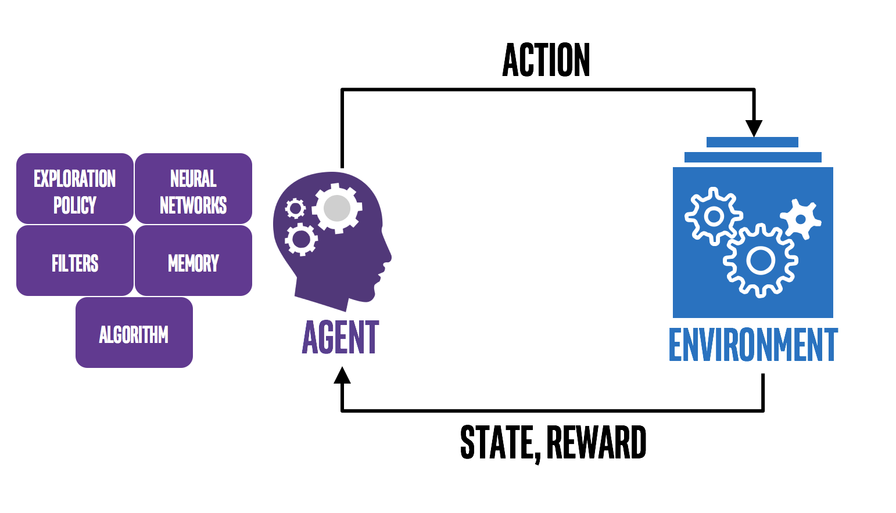
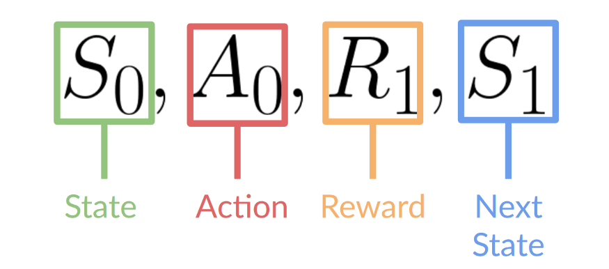
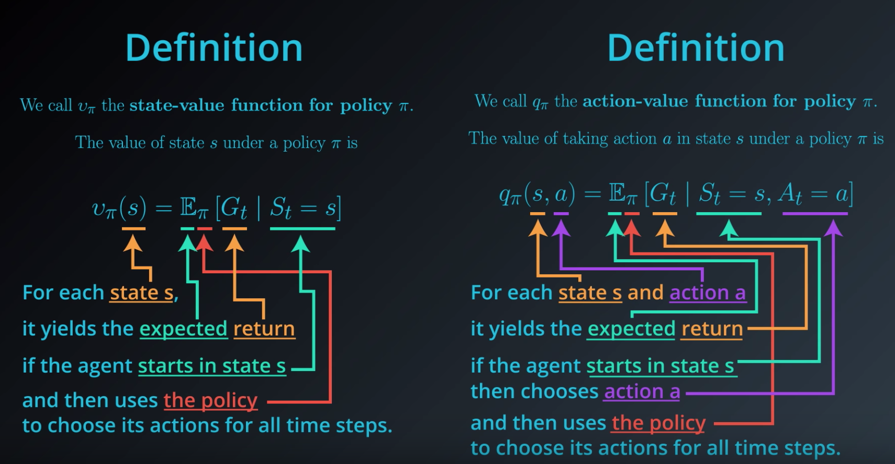
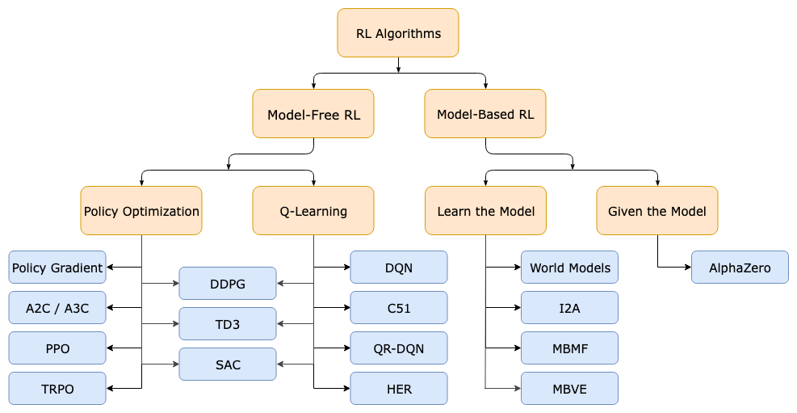

# Reinforcement learning
</img>

Reinforcement Learning is a subfield of machine learning that teaches an agent how to choose an action from its action space, within a particular environment, in order to maximize rewards over time.

Reinforcement Learning has four essential elements:
- Agent. The program you train, with the aim of doing a job you specify.
- Environment. The world, real or virtual, in which the agent performs actions.
- Action. A move made by the agent, which causes a status change in the environment.
- Rewards. The evaluation of an action, which can be positive or negative.

## Formal definition
This RL loop outputs a sequence of state, action and reward and next state.

</img>

- Our Agent receives state S0 from the Environment — we receive the first frame of our game (environment).
- Based on that state S0, the agent takes an action A0 — our agent will move to the right.
- Environment transitions to a new state S1 — new frame.
- Environment gives some reward R1 to the agent — we’re not dead (Positive Reward +1).

## Example
The first step in modeling a Reinforcement Learning task is determining what the 4 elements are, as defined above. Once each element is defined, you’re ready to map your task to them.
Here are some examples to help you develop your RL intuition.
- Determining the Placement of Ads on a Web Page
- Agent: The program making decisions on how many ads are appropriate for a page.
- Environment: The web page.
- Action: One of three: (1) putting another ad on the page; (2) dropping an ad from the page; (3) neither adding nor removing.
- Reward: Positive when revenue increases; negative when revenue drops.

## Supervised, Unsupervised, and Reinforcement Learning: What are the Differences?
- Difference #1: Static Vs.Dynamic
The goal of supervised and unsupervised learning is to search for and learn about patterns in training data, which is quite static. RL, on the other hand, is about developing a policy that tells an agent which action to choose at each step — making it more dynamic.
- Difference #2: No Explicit Right Answer
In supervised learning, the right answer is given by the training data. In Reinforcement Learning, the right answer is not explicitly given: instead, the agent needs to learn by trial and error. The only reference is the reward it gets after taking an action, which tells the agent when it is making progress or when it has failed.
- Difference #3: RL Requires Exploration
A Reinforcement Learning agent needs to find the right balance between exploring the environment, looking for new ways to get rewards, and exploiting the reward sources it has already discovered. In contrast, supervised and unsupervised learning systems take the answer directly from training data without having to explore other answers.
- Difference #4: RL is a Multiple-Decision Process
Reinforcement Learning is a multiple-decision process: it forms a decision-making chain through the time required to finish a specific job. Conversely, supervised learning is a single-decision process: one instance, one prediction.

## Characteristic
- Exploration: Reinforcement learning generally does not have direct guidance information. The Agent should continuously interact with the Environment and obtain the best policy through trial and error.
- Delayed Return: Instructive information for reinforcement learning is rarely given and is often given after the fact (the last state). For example, in chess, the winner can only be known at the end

## Terminology
### Policy
Policies are the rules an agent uses to decide what action to take next. can be deterministic, generally expressed as $\mu$:

$$
a_{t}=\mu\left(s_{t}\right)
$$

Or might be random, generally expressed as $\pi$:

$$
\mathrm{a}_{\mathrm{t}} \sim \pi\left(\cdot \mid \mathrm{s}_{\mathrm{t}}\right)
$$

### State Transition
State transition, which can be deterministic or random, is generally considered to be random, and its randomness comes from the environment which can be represented by the density of states function:

$$
\mathrm{p}\left(\mathrm{s}^{\prime} \mid \mathrm{s}, \mathrm{a}\right)=\mathbb{P}\left(\mathrm{S}^{\prime}=\mathrm{s}^{\prime} \mid \mathrm{S}=\mathrm{s}, \mathrm{A}=\mathrm{a}\right)
$$

### Return
The reward, also known as cumulated future reward, is generally expressed as U, defined as:

$$
\mathrm{U}_{\mathrm{t}}=\mathrm{R}_{\mathrm{t}}+\mathrm{R}_{\mathrm{t}+1}+\mathrm{R}_{\mathrm{t}+2}+\mathrm{R}_{\mathrm{t}+3}+\cdots
$$

where $\mathrm{R}_{\mathrm{t}}$ denotes the rewards at time t. The goal of agent is to maximize the return. RL usually use discounted return, discount rate is $\gamma$ ($\gamma \in (0, 1]$)

### Value Function
For example, in the game of chess, it is defined that winning the game gets 1 point, other actions get 0 points, and the state is the position of the pieces on the board. The values of 1 and 0 alone do not tell how well the agent is doing during the game, but the value function can give more insight.

The value function uses expectations to predict future returns. On the one hand, you can know the quality of the current state without waiting for the actual occurrence of future returns. On the other hand, it summarizes various possible future returns through expectations. Using the value function can be very convenient to evaluate the quality of different strategies.

</img>

- State-value Function: It is used to measure how good or bad the current state $S_t$ is given a given policy $\pi$.
- Action-value Function: It is used to measure how good or bad an action $a_t$ is given a given state $S_t$ and policy $\pi$.

## Algorithm Classification
According to whether the environment is known: Model-Free vs Model-Based. In general, the environment is agnostic, so the model-free problem is mainly studied here.
- Model-free is not to learn and understand the environment. The information given by the environment is the information. Common methods include policy optimization and Q-learning.
- Model-Based is to learn and understand the environment, learn to use a model to simulate the environment, and get feedback through the simulated environment. Model-Based is equivalent to having more simulation environment than Model-Free. Through the simulation environment, it predicts all the situations that will happen next, and then selects the best situation.

</img>

Divided by learning method: On-Policy vs Off-Policy
- On-Policy means that the agent must be present and must learn while playing. A typical algorithm is Sarsa.
- Off-Policy means that the agent can choose to play by itself or watch others play, and learn other people's code of conduct by watching others play. Off-line learning also learns from past experiences, but these past experiences are not necessarily their own. The experience of anyone can be learned, and there is no need to learn while playing, and the time of play and learning can be asynchronous. Typical methods are Q-learning, and Deep-Q-Network.

According to learning objectives: Policy-Based and Value-Based
- The Policy-Based method directly outputs the probability of the next action, and selects the action according to the probability. However, it is not necessarily that the action will be selected with the highest probability, and it will still be considered from the whole. Suitable for non-continuous and continuous actions. Common methods are Policy gradients.
- The Value-Based method outputs the value of the action and selects the action with the highest value. Suitable for non-sequential actions. Common methods are Q-learning, Deep Q Network and Sarsa.
- A more powerful method is the combination of the two: Actor-Critic, Actor makes actions according to probability, and Critic gives values according to actions, thereby accelerating the learning process. Common ones are A2C, A3C, DDPG, etc.

## Toolkit
- [OpenAI Gym](https://gym.openai.com/) is a toolkit for developing and comparing reinforcement learning algorithms. It supports teaching agents in everything from walking to playing games like Pong or Pinball.
- [Duckietown](https://github.com/duckietown/gym-duckietown): Duckietown self-driving car simulator environments for OpenAI Gym.
- [Tianshou](https://tianshou.readthedocs.io/en/latest/): Tianshou (天授) is a reinforcement learning platform based on pure PyTorch.
- [DeepMind Lab](https://github.com/deepmind/lab): DeepMind Lab is a 3D learning environment based on id Software's Quake III Arena via ioquake3 and other open source software.

## Books & Courses
- [CS234: Reinforcement Learning Winter 2019](https://www.youtube.com/playlist?list=PLoROMvodv4rOSOPzutgyCTapiGlY2Nd8u): This is a video version of the course and the [notes](https://github.com/tallamjr/stanford-cs234).
- [Easy-RL](https://datawhalechina.github.io/easy-rl/#/): A book written Hung-Yee Li.
- [Reinforcement learning: an introduction](https://web.stanford.edu/class/psych209/Readings/SuttonBartoIPRLBook2ndEd.pdf), a book written from stanford and its [code implementation](https://github.com/ShangtongZhang/reinforcement-learning-an-introduction).
- [Awesome Reinforcement Learning](https://github.com/aikorea/awesome-rl)
- [强化学习](https://mofanpy.com/tutorials/machine-learning/reinforcement-learning/)
